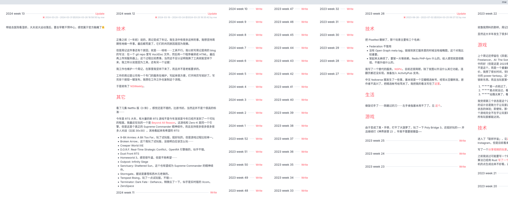

= NSWeekly

A naively simple self-hosted weekly snippet tool

== Introduction

NSWeekly is an extremely simple tool to let you (and other people)
write weekly snippets (like a journal).

== Deployment

NSWeekly depends on libcurl, sqlite, and https://github.com/commonmark/cmark[cmark].

Arch Linux users can build NSWeekly using the
link:packages/arch/PKGBUILD[PKGBUILD] in the repo; otherwise

1. Build the binary using CMake.
2. Copy the binary to somewhere in `$PATH`.
3. Copy the `statics` and `templates` directory to a suitable place
(for example `/var/lib/nsweekly`).
4. Create a configuration file at `/etc/nsweekly.yaml`, and at a
minimum set `data-dir` to the directory you put the `statics` and
`templates` in. NSWeekly will create a sqlite3 database file in this
directory.

== Configuration

See an link:packages/arch/nsweekly.yaml[example configration file].

NSWeekly allows multiple users to write weeklies in the same instance.
However, it does not have any ability to manage the user accounts. All
user management is delegated to an external OpenID Connect server. In
principle you can let it use the big public services such as Google or
GitHub, but I have only tested it on my self-hosted KeyCloak server.
There are three configuration options involved:

- `client-id`: The client ID you registered with the OpenID Connect
  service
- `client-secret`: The client secret the OpenID Connect provided for
  your registered client.
  service
- `openid-url-prefix`: This is the “root URL” of the OpenID Connect.
  Suppose you put `https://example.com` here (trailing slash will be
  removed automatically), NSWeekly will visit
  `https://example.com/.well-known/openid-configuration` to discover
  the endpoints of the OpenID Connect service.
- `url-prefix`: the expected URL prefix of your NSWeekly service. This
  is used to provide a OpenID redirection URL. If you set this to
  `https://example.com` (trailing slash will be removed
  automatically), NSWeekly will watch
  `https://example.com/openid-redirect` for incoming OpenID
  redirections. Note that right now NSWeekly does not support hosting
  at a non-root path, so this value should not contain a URL path.

I should point out that NSWeekly uses the username from the OpenID
Connect service as a unique ID for the user. If the OpenID Connect
service provides a `name` field from the user info endpoint, NSWeekly
will use that, otherwise NSWeekly will use `preferred_username` from
the user info endpoint.

Other notable options:

- `guest-index`: This determines what a guest (a visitor that is not
  logged in) see when visiting the service. Right now the only
  possible value is `user-weekly`, meaning the guest is redirected to
  the weekly of a user.
- `guest_index_user`: This defines the default user whose weekly are
  shown to guests, when `guest-index` is `user-weekly`.
- `default_lang`: The default IETF BCP 47 language tag (RFC 5646) of
  the weekly posts. Right now this is global.
