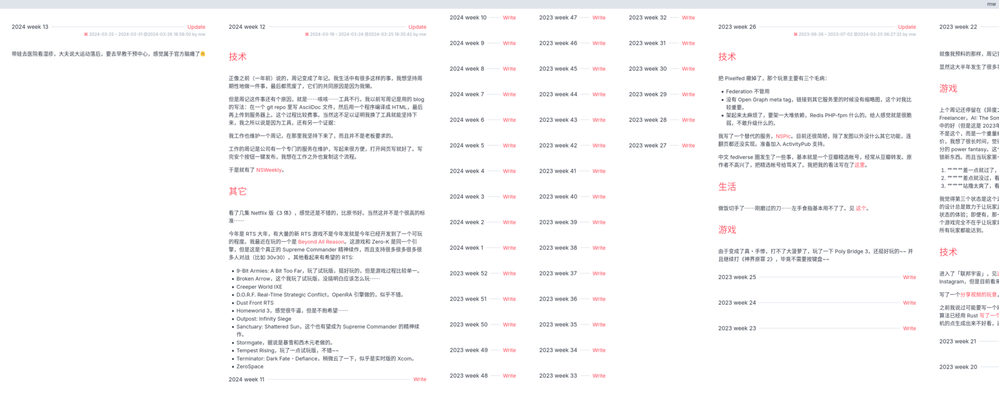

= NSWeekly

A naively simple self-hosted weekly snippet tool

== Introduction

NSWeekly is an extremely simple tool to let you (and other people)
write weekly snippets (like a journal) in CommonMark.

== Deployment

NSWeekly depends on libcurl, thread-safe SQLite 3.35.0 or newer, and https://github.com/commonmark/cmark[cmark].

Arch Linux users can build NSWeekly using the
link:packages/arch/PKGBUILD[PKGBUILD] in the repo; otherwise

1. Build the binary using CMake.
2. Copy the binary to somewhere in `$PATH`.
3. Copy the `statics` and `templates` directory to a suitable place
(for example `/var/lib/nsweekly`).
4. Create a configuration file at `/etc/nsweekly.yaml`, and at a
minimum set `data-dir` to the directory you put the `statics` and
`templates` in. NSWeekly will create a sqlite3 database file in this
directory.

== Configuration

See an link:packages/arch/nsweekly.yaml[example configration file].

NSWeekly allows multiple users to write weeklies in the same instance.
However, it does not have any ability to manage the user accounts. All
user management is delegated to an external OpenID Connect server. In
principle you can let it use the big public services such as Google or
GitHub, but I have only tested it on my self-hosted KeyCloak server.
There are four configuration options involved:

- `client-id`: The client ID you registered with the OpenID Connect
  service
- `client-secret`: The client secret the OpenID Connect provided for
  your registered client.
  service
- `openid-url-prefix`: This is the “root URL” of the OpenID Connect.
  Suppose you put `https://example.com` here (trailing slash will be
  removed automatically), NSWeekly will visit
  `https://example.com/.well-known/openid-configuration` to discover
  the endpoints of the OpenID Connect service.
- `url-prefix`: the expected URL prefix of your NSWeekly service. This
  is used to provide a OpenID redirection URL. If you set this to
  `https://example.com` (trailing slash will be removed
  automatically), NSWeekly will watch
  `https://example.com/openid-redirect` for incoming OpenID
  redirections. Note that right now NSWeekly does not support hosting
  at a non-root path, so this value should not contain a URL path.

NSWeekly uses `preferred_username` from the OpenID Connect user info
endpoint as the account key. If that field is absent, it uses `name`.
Changing the account key will make existing weeklies appear under the
old account.

Other notable options:

- `guest-index`: This determines what a guest (a visitor that is not
  logged in) see when visiting the service. Right now the only
  possible value is `user-weekly`, meaning the guest is redirected to
  the weekly of a user.
- `guest_index_user`: This defines the default user whose weekly are
  shown to guests, when `guest-index` is `user-weekly`.
- `default_lang`: The default IETF BCP 47 language tag (RFC 5646) of
  the weekly posts. Right now this is global.

== Development

Configure with `cmake -S . -B build`, build with
`cmake --build build -j24`, and run
`ctest --test-dir build --output-on-failure`.
To build against a local libmw checkout, configure with
`-DFETCHCONTENT_SOURCE_DIR_LIBMW=/path/to/libmw`.
The route tests start a server on a temporary loopback port. Storage tests
use isolated temporary databases; they do not open the deployed database.
Run `python3 tests/smoke_test.py build/nsweekly` to exercise production startup,
login, editing, and persistence against a local OpenID stub and legacy schema.

`App` owns the authentication backend, shared sessions, user storage, and
weekly storage. `AuthModule` and `WeeklyModule` register their own routes.
`App` derives from `mw::HTTPServer` and registers routes in `setup()`.
`start()` launches the server thread; `wait()` blocks until it exits.
Call `stop()` before `wait()` when shutting down from another thread.
User and weekly SQLite implementations own separate connections to the same
file. New features should provide their own storage and HTTP module with
explicit wiring in `App`.

The module extraction preserves existing guest redirects, including the two
Location headers produced for an unknown guest user, and applies refreshed
cookies only on the root route. Two undefined accesses are corrected:
empty weekly ranges return an empty list, and an authorized edit page with
no weekly result returns HTTP 404. Regression tests cover both outcomes.
The HTML fixture under `tests/fixtures` was captured before extraction;
only its clock-dependent update timestamp is normalized for comparison.

== Game tracking

Visit `/games/` after signing in, or `/games/USERNAME` to read a public
tracker. Games links on weekly pages provide navigation. Owners can add,
edit, rename, and delete games through native forms. Notes and every other
tracking field are public. Notes use MacroDown; weeklies retain CommonMark.
Sorting is local to the page and resets on reload. Forms work without
JavaScript; JavaScript enhances dialogs and sorting. POSTs require an
Origin matching `url-prefix`.

Game storage creates `GameTracking` and `GamePlatforms` alongside the
existing tables, using a separate connection. Scalar and platform saves
commit together. Missing hours and zero hours remain distinct. Names are
stripped, case-sensitive, and unique within an account.

MacroDown is pinned to `31e42d5f8ed10f3cf19028d9773bdd0cdcccdf7f`, and libmw
to `2d68269cd97f47e46bcf6007595919bfe0cbea9e`. CMake consumes both upstream sources without modifying either dependency.
libmw, uni-algo, and Unicode data notices are preserved in `licenses/`
and installed by the Arch package.
The pinned MacroDown tree has no standalone license file. The existing cmark
license and dependency remain in place. MacroDown has no resource budgets
in this release, as agreed in the implementation design.

For local development, pass
`-DFETCHCONTENT_SOURCE_DIR_MACRODOWN=/path/to/macrodown` as well as the
libmw override. MacroDown uses uni-algo v1.2.0. libmw supplies httplib
transitively through `mw::http-server`; the version verified here is
`edc9760005c7358adc7a6170ff0be4c2e242ee09`. libmw currently follows httplib's
upstream default branch. For reproducible release builds, check out that
httplib revision and pass `-DFETCHCONTENT_SOURCE_DIR_HTTPLIB=/path/to/httplib`.
Local dependency overrides intentionally take precedence over pins; verify
the checkout revisions when preparing a release. Do not add a separate
httplib target or link to the application.

=== Temporary Tracker migration

Stop the service and back up the closed database, or use SQLite's backup
API. Export only the Tracker sheet as UTF-8 CSV. Run:

[source,sh]
----
nsweekly --config /etc/nsweekly.yaml \
    --import-games-csv /tmp/tracker.csv --import-games-user mw
----

The target account must already exist. Import runs without OpenID discovery,
templates, or an HTTP listener. All rows are validated before inserting any
games. Invalid rows exit 2; configuration failures exit 3; storage failures
exit 4. Successful imports exit 0 and report input, blank, inserted, and
both duplicate counts. `Game` (or `Name`) and `Status` headers are required;
optional headers may be omitted or reordered. Platforms from both columns
are combined. Review and extra columns are ignored and reported.

The importer never overwrites existing games. Repeating an import skips
existing names. If storage fails partway through, the report identifies the
record and committed insert count; correct the failure and rerun. Dates
must use `YYYY-MM-DD`; hours must be nonnegative 32-bit integers. Notes
retain internal whitespace and MacroDown source.

For read-only preflight, run the import on a copy of the stopped database
in a temporary data directory, using a configuration pointing there. Compare
its report with the CSV before running against the deployment. Restart and
inspect totals, platforms, notes, dates, zero hours, and missing hours. Keep
the original export and backup until verified. An older binary can ignore
the games tables; do not delete them on rollback. Remove the temporary import
flags in a separate change after the operator verifies the migration and
one repeat run.

The Tracker fixture contains observed blank/end-only/two-platform patterns;
its `Synthetic zero` record adds synthetic zero-hour and multiline cases.
Run the smoke test for production games CRUD and CLI import, and use
`tests/games_browser.html` for repeatable browser sorting and dialog checks.
