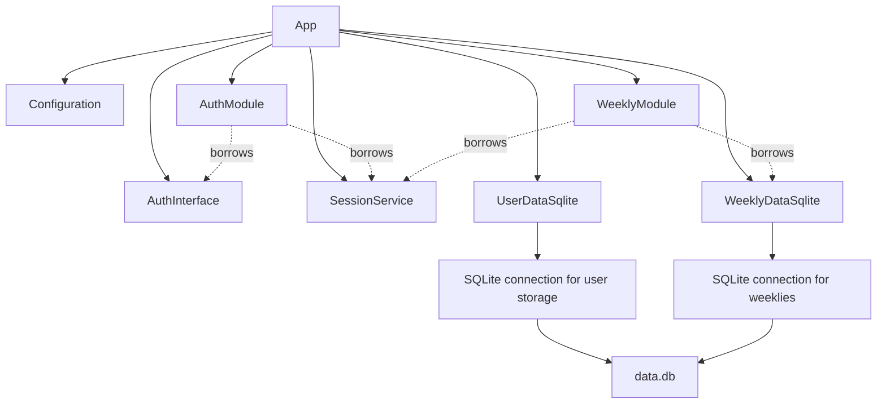

# Refactor NSWeekly into modules

Status: proposed implementation design.

## Objective and scope

Refactor the service into composed HTTP modules while retaining the existing
user interface, HTTP behavior, configuration, and stored data. Weekly snippets
become the first feature module. Authentication becomes a separate HTTP module
with a shared session service. Adding another feature should require its own
module and data implementation plus explicit wiring in `App`.

This change introduces no new pages, URL prefixes, configuration keys, module
discovery, dynamic loading, connection pools, or application mutexes. It does
not redesign authentication or fix unrelated behavior. The deployment layout,
binary name, SQLite file, templates, and static assets remain compatible.

## Current implementation

`src/app.hpp` and `src/app.cpp` combine server startup, static mounting, URL
generation, session validation, authentication handlers, weekly handlers,
template rendering, and weekly JSON conversion. `App::start()` constructs a
local `httplib::Server`, installs all routes, and listens synchronously.

`DataSourceInterface` combines weekly storage with user lookup.
`DataSourceSqlite` owns a `SQLite` connection and creates both `Users` and
`Weeklies` in `fromFile()`. `updateWeekly()` looks up a user, creates that user
if missing, and upserts a weekly. `createUser()` currently inserts and then
reads connection-wide `lastInsertRowID()`.

`main.cpp` constructs configuration, authentication, and SQLite data storage
before transferring authentication and data storage to `App`. Configuration
is copied into `App`; the authentication implementation currently borrows
the configuration constructed in `main`.

The existing data implementation also supplies empty weekly placeholders for
Mondays without posts. This is part of current page behavior and must survive
the refactor, including ordering, timestamps, and rendered content.

## Ownership and composition

`App` owns configuration, authentication, data implementations, shared
services, and HTTP modules. Modules borrow only the dependencies they use.
Each module-specific SQLite data implementation owns its own connection to
the same `<data-dir>/data.db` file. The HTTP module borrows the data interface;
it does not own or access the SQLite connection directly.



The arrows from `App` denote ownership. Dashed arrows denote references.
Configuration references are omitted from the diagram for readability.
`SessionService` borrows `AuthInterface`; it owns no authentication backend.
The root handler borrows user storage for the existing guest-user lookup.

Keep concrete module members rather than introducing `ModuleInterface`.
The set of modules is fixed and explicitly constructed. Each module exposes
`registerRoutes(httplib::Server&)`; `App` calls those methods in a fixed order.
No runtime registry or virtual lifecycle is needed.

Declare members in dependency order: configuration, owned backends, session
service, then modules. C++ destroys members in reverse declaration order, so
borrowers disappear before their dependencies. Use `unique_ptr` for injected
polymorphic backends and references for required borrowed dependencies.
Do not use `shared_ptr`.

Delete copy and move operations on `App` and HTTP modules. Route callbacks
capture `[this]`, and moving their targets would invalidate those captures.
Keep the server local to `start()` initially. It is destroyed before `start()`
returns; all handlers must finish before modules can be destroyed.

## Component responsibilities

| Component | Responsibility |
| --- | --- |
| `App` | Own dependencies, compose modules, handle `/`, mount statics, listen |
| `AuthModule` | Register and handle `/login` and `/openid-redirect` |
| `SessionService` | Parse cookies, validate tokens, refresh tokens, set cookies |
| `WeeklyModule` | Register weekly/edit routes, parse arguments, render pages |
| `WeeklyDataInterface` | Describe weekly retrieval and update operations |
| `WeeklyDataSqlite` | Implement weekly storage using its owned connection |
| `UserDataInterface` | Describe shared user lookup and creation operations |
| `UserDataSqlite` | Implement user operations using its owned connection |
| Shared user SQL helpers | Execute user operations on a supplied connection |
| `SQLite` | Connection/statement lifetime, binding, stepping, timeout setup |
| URL helpers | Preserve the existing named URLs without depending on `App` |

`Users` is shared infrastructure, not a new user-facing module. Authentication
continues to delegate identity to OpenID Connect. A future feature may have
its own data interface and connection without adding methods to weekly storage.

## Interfaces and dependency injection

Rename the existing weekly portion of `DataSourceInterface` to
`WeeklyDataInterface`. Retain these signatures and their current semantics:

```cpp
// Describes storage operations for weekly snippets.
class WeeklyDataInterface
{
public:
    // Allows destruction through the storage interface.
    virtual ~WeeklyDataInterface() = default;

    // Returns weekly posts and placeholders in ascending week order.
    virtual E<std::vector<WeeklyPost>> getWeeklies(
        const std::string& user, const Time& begin,
        const Time& end) const = 0;

    // Creates or updates a weekly, ensuring its author exists first.
    virtual E<void> updateWeekly(
        const std::string& username, WeeklyPost&& new_post) const = 0;

    // Retrieves the existing rolling one-year range.
    E<std::vector<WeeklyPost>> getWeekliesOneYear(
        const std::string& user) const;
};
```

`UserDataInterface` exposes `getUserID(name)` returning
`E<std::optional<int64_t>>`, `createUser(name)` returning `E<int64_t>`, and
`ensureUser(name)` returning `E<void>`. Preserve `createUser()`'s error for an
existing name; `ensureUser()` is the explicitly idempotent alternative.

`WeeklyModule` receives `const Configuration&`, `WeeklyDataInterface&`, and
`SessionService&`. It owns its `inja::Environment` and weekly handlers.
`AuthModule` receives `AuthInterface&` and the shared cookie/session facility.
Handlers remain directly callable for unit tests, but route-specific helpers
and JSON conversion can be private or implementation-local.

`SessionService::validateSession(req)` returns the existing
`E<SessionValidation>` shape: status `VALID`, `REFRESHED`, or `INVALID`, user
information, and replacement tokens when refreshed. Move cookie parsing and
token-cookie formatting with it. Do not change when individual handlers
apply replacement cookies: currently `/` does so, while weekly handlers do
not. Avoid introducing a global authentication middleware in this refactor.

Continue to return `E<>` errors rather than throwing for expected failures.
Do not combine this work with replacing the existing error type. If new shared
utilities are needed, check local libmw for an appropriate implementation.

## Routing, templates, and URLs

Each module registers its own handlers on the shared server. Parameter
extraction, date validation, and HTTP error responses stay with the module.
Register routes exactly once before listening. Lambdas should only adapt the
httplib callback to a named handler; substantive logic belongs in functions.

| Method and path | Owner | Preserved behavior |
| --- | --- | --- |
| `GET /` | `App` | Session/guest redirect policy |
| `GET /login` | `AuthModule` | 301 redirect to provider initial URL |
| `GET /openid-redirect` | `AuthModule` | Exchange code, set cookies, 301 to `/` |
| `GET /weekly/:username` | `WeeklyModule` | Render last year's weekly list |
| `GET /weekly/:username/:date` | `WeeklyModule` | Render individual weekly |
| `GET /edit/:username/:date` | `WeeklyModule` | Render authorized edit page |
| `POST /edit/:username/:date` | `WeeklyModule` | Save and redirect to `/` |
| `/statics/*` | `App` | Existing httplib directory mount |

Preserve the two current date parsing paths during extraction: GET handlers
use `strToDate()`, while POST uses stream parsing and `year_month_day::ok()`.
Consolidating them could change accepted inputs and belongs in later work.
Edit routes continue to reject unauthorized users with 401 and non-Monday
dates with 404. Invalid route dates retain their current 400 responses.

Retain the `url_for(name, arg)` template callback and all current names:
`index`, `openid-redirect`, `weekly`, `statics`, `login`, and `edit`.
Extract the current mapping into a small shared URL utility with no `App`
reference. Weekly path construction belongs in named weekly URL helpers;
the compatibility mapping delegates to them. This deliberately keeps a small
central mapping to avoid modifying templates or introducing a route registry.
Unknown names continue to return an empty string.

The root handler calls the weekly URL helper rather than a weekly HTTP handler.
Keep the root policy tied to weeklies for now; a configurable default module
would be a new feature.

Keep template paths and content unchanged. Preserve weekly JSON keys:
`week_str`, `date_str`, `week_begin`, `week_end`, `update`, `content`, `lang`,
and `author`. Page contexts retain `username`, `session_user`, `this_url`,
`weeklies`, and `weekly` where currently supplied. Preserve Markdown rendering,
raw edit content, list reversal, empty-week placeholders, and preview assets.

## SQLite connections and single-statement operations

Each data implementation receives an owned `unique_ptr<SQLite>` opened against
the same file. There is no connection provider or pool. Authentication has no
SQLite connection unless it actually gains a storage requirement.

Set a fixed `BUSY_TIMEOUT_MS` of 5000 on every connection using
`sqlite3_busy_timeout()`. This is an initial internal default, not a new YAML
setting. Check setup errors before serving requests. The timeout waits on
lock contention but does not guarantee that `SQLITE_BUSY` cannot occur.
Propagate remaining failures through the existing error and response path.
See [SQLite busy timeout](https://sqlite.org/c3ref/busy_timeout.html).

HTTP requests can overlap even with a single user. Open connections with
`sqlite3_open_v2()` using `SQLITE_OPEN_READWRITE | SQLITE_OPEN_CREATE |
SQLITE_OPEN_FULLMUTEX`, and require a thread-safe SQLite build. SQLite then
serializes calls on a connection internally; this adds no application mutex.
Every call creates its own statement and binds its own arguments. Do not cache
mutable prepared statements across requests. See
[SQLite threading modes](https://sqlite.org/threadsafe.html).

Do not add explicit `BEGIN`, `COMMIT`, transaction guards, or savepoints.
Each statement completes under SQLite's implicit transaction behavior. Fully
consume and finalize statements before returning; do not return live cursors.
The service still has one active writer at a time across connections. See
[SQLite transaction rules](https://sqlite.org/lang_transaction.html).

“Single statements” means no atomicity assumptions between SQL calls. An
operation may execute independent statements where current behavior requires
them. In particular, weekly save must retain automatic user creation:

1. Ensure the user with `INSERT INTO Users(name) VALUES (?) ON CONFLICT(name)
   DO NOTHING`, executed on the weekly connection.
2. Upsert the weekly using a scalar subquery selecting that user's ID.
3. Return success only after the weekly statement finishes.

These statements do not form an atomic unit. A failed weekly save may leave a
user without a post, which is already possible in the current implementation.
There is no user-deletion route, so no new delete-between-statements handling
is required. Use bound parameters throughout. Preserve the current weekly
unique key and update fields rather than using `INSERT OR REPLACE`.

Shared user SQL helpers take `SQLite&`. Both user storage and weekly storage
can use them with their own connections; weekly storage does not call another
repository whose connection differs from its own. This keeps reusable user
SQL separate from connection ownership.

For reads, replace the user-ID lookup plus weekly query with one SELECT using
a `Users` join. A LEFT JOIN can distinguish an unknown user from an existing
user with no stored posts. Handle NULL weekly columns explicitly, since the
current `SQLite::eval()` string conversion does not support NULL. Add narrow
optional-column support if this query needs it. Keep placeholder generation
in C++ and preserve the existing unknown-user error.

Use `INSERT ... RETURNING id` for `createUser()` instead of
`lastInsertRowID()`. Collect the returned row and finish the statement before
returning. This requires SQLite 3.35.0 or newer; express the minimum version
in CMake and deployment documentation. See
[SQLite RETURNING](https://sqlite.org/lang_returning.html).

Remove the unconditional `ROLLBACK` from the `SQLITE_BUSY` branch in
`SQLite::eval()`. With no explicit transactions, an unrelated rollback has no
place in this error path. Keep journal mode and foreign-key settings unchanged
in this refactor; WAL and new enforcement rules are separate decisions.

## Schema and startup

Retain the exact existing `Users` and `Weeklies` definitions, including table
names, column names, integer timestamp encoding, and uniqueness constraints.
No data rewrite or schema-version framework is required for this extraction.

Provide explicit schema initialization functions returning `E<void>`:
shared user storage owns creation of `Users`; weekly storage owns creation
of `Weeklies`. Use the existing `CREATE TABLE IF NOT EXISTS` statements.
Future modules own initialization of their own tables.

Startup order is:

1. Read configuration and validate the existing URL prefix.
2. Allocate `App` at its final address and store its configuration.
3. Construct authentication against the App-owned configuration.
4. Open and configure user and weekly data connections to `data.db`.
5. Initialize `Users`, then `Weeklies`, before accepting requests.
6. Preserve the current startup attempt to create user `mw` and its logging.
7. Construct the session service and HTTP modules from stable references.
8. Mount statics, register the root and module routes, and listen.

Use `App::create(...)` returning `E<std::unique_ptr<App>>` for fallible wiring.
Keep an injection path accepting fake authentication and data interfaces for
tests; it should not open files or contact the OpenID provider. Ensure creation
failures destroy partially constructed dependencies in safe order. Retain
existing startup failure categories and exit codes where applicable.

Opening additional connections must not touch an unrelated file path.
For tests that need shared storage, use a temporary database file: separate
connections opened as `:memory:` create separate databases.

## Compatibility and known edge cases

The refactor preserves observable successful behavior and defined error
responses. Characterize ambiguous paths before extraction rather than silently
repairing them. Current examples include the guest root handler setting a login
redirect for a missing user and then overwriting it with a weekly redirect,
and session refresh cookies being applied only by the root handler.

There are also potential invalid accesses in placeholder generation for an
empty week range and in the edit handler's unchecked first result. Undefined
behavior is not a compatibility contract. Record any necessary narrow fix
separately, with a regression test and an explicit intended HTTP outcome.
Do not roll unrelated fixes into this architectural change.

## Proposed file organization

Keep files under `src/` initially; directories are unnecessary for the current
number of modules. Use `weekly_module.hpp/.cpp`, `weekly_data.hpp/.cpp`,
`auth_module.hpp/.cpp`, `session_service.hpp/.cpp`, `user_data.hpp/.cpp`,
`user_sql.hpp/.cpp`, and `route_urls.hpp/.cpp`. Existing `weekly.hpp/.cpp`
continues to describe posts and rendering. Existing `auth.hpp/.cpp` remains
the authentication backend. `database.hpp/.cpp` remains the generic wrapper.

Remove `data.hpp/.cpp` after all references and CMake source lists migrate.
Move the unrelated `copyToHttplibReq()` helper and its test out of `App` into
an HTTP adaptation utility. Keep all new public items documented with intent
comments and follow the repository's C++ naming and formatting conventions.

## Implementation sequence

1. Add characterization tests for current routes, templates, cookies, and
   storage results. Establish results before moving implementations.
2. Add connection configuration and `RETURNING`-based user creation; split
   user and weekly storage interfaces and implementations. Preserve the schema.
3. Extract `SessionService` without changing its decisions or cookie timing.
4. Extract URL helpers and retain the existing template callback contract.
5. Move weekly handlers, rendering, and registration into `WeeklyModule`.
6. Move authentication handlers and registration into `AuthModule`.
7. Make `App` own and wire all dependencies, keeping only root policy,
   static mounting, and server lifecycle. Update `main.cpp` and startup errors.
8. Move tests to their owning components, add route-level integration tests,
   remove obsolete forwarding methods, and update build sources.

Each stage should compile and retain behavior. Temporary forwarding methods
may keep callers working during extraction, but remove them in the final
structure so `App` does not retain feature handler interfaces.

## Verification and acceptance

Unit tests cover module handlers using fake storage/authentication and real
template fixtures. Test session states, token refresh failures, ownership checks,
invalid dates, Monday validation, error mapping, redirects, and cookie headers.
Freeze relevant times or compare stable fields to avoid clock-dependent output.

Storage tests cover existing and new databases, user uniqueness, idempotent
ensure-user calls, generated IDs, weekly insert/update, language and format,
unknown users, empty placeholders, range boundaries, and ascending order.
Test separate user/weekly connections to one temporary file and confirm changes
are visible after completed statements. Include simultaneous ensures/saves to
detect duplicate-user races and cross-request generated-ID mistakes.

Route tests register modules on a local test server and exercise actual HTTP
paths. Verify verbs and path parameters, response status, Location and cookie
headers, content type, and rendered body. Compare HTML from identical fixtures
before and after extraction. Verify static assets and preview resource URLs.

Build with `cmake --build build -j24` and run
`ctest --test-dir build --output-on-failure` after configuring dependencies.
Manual smoke verification covers login, guest redirect, weekly list, single
weekly, editing, preview, saving, and reopening the service against an existing
database. Use a temporary database for tests rather than the user's live file.

The refactor is complete when existing URLs and templates work unchanged,
stored posts need no conversion, modules register their own HTTP routes,
`App` owns the shared dependencies, data implementations own separate
connections, and no all-feature data interface or App-dependent module remains.

## Future changes

Add another feature by defining its data interface, SQLite implementation and
schema initializer, HTTP module, and explicit App wiring. Add a transaction
abstraction only when an operation requires atomic multi-statement work;
revisit same-connection request coordination at that point. Cross-module
atomic work must deliberately select one connection for the whole transaction.
Connection pooling, dynamic modules, configurable landing pages, and versioned
migrations remain outside this refactor.
