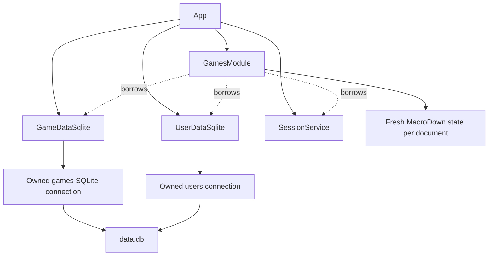

# Game tracking module

Status: proposed implementation design.

Requirements: [prd-games.md](../prd-games.md).
Architecture baseline: [module design](design-0-modules.md) and the current
`App`, `SessionService`, user storage, and weekly module implementations.
Code baseline reviewed through `07c7c6a`, including the libmw HTTP/error
migration and direct App setup with libmw request/response aliases. Current
code takes precedence over the earlier module design's server-lifetime,
route-registration, and error-container descriptions.

## 1. Scope and decisions

Implement the tracking portion of the games module under `/games/`.
Each account has an independent public table. Visitors can read every
tracking field, including notes. An authenticated owner can add, edit,
rename, and delete records through dialogs. Notes use MacroDown. A temporary
command-line mode imports one exported Tracker CSV into one existing user.

Reviews, journals, screenshot uploads, game-name suggestions, replay
sessions, and daily activity tracking are deferred. Do not create their
tables, endpoints, buttons, or placeholder tabs in this release. In
particular, neither the tracking model nor its dialog has a Review field.

The principal implementation decisions are:

- Add `GamesModule` and `GameDataInterface` alongside the weekly module.
- Keep one tracking row per user and stripped game name, enforced by SQL.
- Store each selected platform in a `GamePlatforms` join table, with integer
  enum values and SQL constraints. Save the game and its platforms together
  in a transaction.
- Preserve missing values explicitly. Zero hours is a recorded value.
- Return the complete table and sort its existing rows in the browser.
- Share validation between HTTP writes and the CSV importer.
- Import validated rows without overwriting existing games; report
  duplicates, and make a repeated import safe.

These choices are design proposals where the PRD does not specify behavior.
The source is
[MetroWind's Unfair Game Reviews](https://docs.google.com/spreadsheets/d/1BK6kReBhj3xyfv-4wJdDBMUCZeZwdjLU3FxTdDkFL1Y/edit).
Its README, Tracker headers, dropdown validation, date formats, and populated
Tracker rows were inspected through Google Drive on 2026-10-08. Only README
and Tracker are inputs to this design; Reviews remains outside its scope.

## 2. Existing system and integration boundaries

The service is C++23, using libmw's HTTP server and errors, cpp-httplib,
inja, nlohmann/json, SQLite, and cxxopts. `App` derives from `mw::HTTPServer`
and owns backends and modules. Its `setup()` mounts statics and registers
root and module routes directly before listening. User and weekly storage
each own a separate connection to `<data-dir>/data.db`.
`Users.name` is the existing account key. Identity
comes from OpenID Connect, via `SessionService`; games introduces no account
management or new authentication scheme.

`WeeklyPost::render()` currently uses cmark. It does not satisfy the games
requirement to use MacroDown. Leave weekly rendering in its current module
and introduce an explicit games renderer. Every Markdown field subsequently
added to games must use that renderer too.

Extend `App` with owned game storage and an owned `GamesModule`. Production
startup opens a third configured connection, initializes `Users` before
the games schema, then composes the games module. Extend the injected
`App::create()` path to accept fake game storage. Update existing test
callers with an empty fake rather than opening a real database implicitly.

Add `games_module->registerRoutes(server)` directly in `App::setup()`
alongside the existing module calls. `App` no longer exposes a public
`registerRoutes()` method. Keep the module entry point
`GamesModule::registerRoutes(httplib::Server&)`, matching AuthModule and
WeeklyModule. Use `mw::HTTPServer::Request` and `mw::HTTPServer::Response`
in games handler signatures, route callbacks, and handler tests, with
`<mw/http_server.hpp>` included by the module header. These aliases preserve
httplib behavior while following the current application interface.

Preserve the current lifecycle: `main()` checks the `mw::E<void>` returned
by `start()` and calls `wait()` after success. `start()` launches the server
thread; it is no longer a synchronous listen call. When a test or another
thread requests shutdown, call `stop()` and then `wait()` before destroying
App or any borrowed dependency. Do not rely on member destruction or the
base destructor to drain requests. Start each instance once, register routes
once through setup, and join its server thread once. Composed route tests
exercise the App-owned server through this lifecycle rather than creating
a second listener or calling setup directly.

Declare game storage before the module members so borrowers are destroyed
first. The module borrows configuration, game storage, user storage, and
sessions. It owns its template environment. Delete its copy and move
operations because registered callbacks capture its address. Use
`unique_ptr` for ownership and references for required dependencies.



Keep `/` and its weekly landing policy unchanged. Add a Games link for the
signed-in account and a link from a user's weekly page to that same user's
games. Add the corresponding Weeklies link on the games page. These links
provide navigation without introducing a public user directory.

## 3. Domain model and validation

### 3.1 Record shape

Use `GameRecord` for persisted records and `GameInput` for proposed field
values. `GameRecord` contains a positive `int64_t id` and a `GameInput`.
An ID identifies a tracking record, not a globally catalogued game. Do not
put the name in an edit/delete URL: names can change and contain punctuation.
There is no shared game catalogue in this release.

| Field | C++ representation | Empty representation | Rule |
| --- | --- | --- | --- |
| Name | `std::string` | Prohibited | Apply `mw::strip()`; nonempty |
| Platforms | `std::vector<GamePlatform>` | Empty vector | Values from `PLATFORM_CHOICES`; unique |
| Status | `GameStatus` | Prohibited | Exactly one of five choices |
| Completion | `std::optional<GameCompletion>` | `nullopt` | Independent of status |
| Hours | `std::optional<int32_t>` | `nullopt` | Nonnegative integer |
| Start date | `std::optional<std::chrono::year_month_day>` | `nullopt` | Valid calendar date |
| End date | Same as start date | `nullopt` | If both dates exist, end >= start |
| Notes | `std::optional<std::string>` | `nullopt` | Stripped MacroDown source |

Use uppercase enum members, explicit integer assignments in C++, and these
conversion tables. Database enum values are integers; form codes and display
labels remain strings at the HTTP and presentation boundaries.

| `GameStatus` | DB integer | Form code | Display label |
| --- | --- | --- | --- |
| `NOW_PLAYING` | 0 | `now_playing` | Now Playing |
| `QUEUE` | 1 | `queue` | Queue |
| `SHELVED` | 2 | `shelved` | Shelved |
| `DONE` | 3 | `done` | Done |
| `WISHLIST` | 4 | `wishlist` | Wishlist |

| `GameCompletion` | DB integer | Form code | Display label |
| --- | --- | --- | --- |
| `NOT_STARTED` | 0 | `not_started` | Not Started |
| `PARTIAL` | 1 | `partial` | Partial |
| `FINISHED` | 2 | `finished` | Finished |
| `PLATINUM` | 3 | `platinum` | Platinum |
| `ENDLESS` | 4 | `endless` | Endless |

Persist the explicitly assigned integers, never ordinals inferred from
declaration order. Reordering declarations must preserve their assigned
values. Never renumber or reuse a persisted value; add future choices with
new integers. Absent completion is SQL NULL, distinct from integer 0.
Retain these meanings from the
[spreadsheet README](https://docs.google.com/spreadsheets/d/1BK6kReBhj3xyfv-4wJdDBMUCZeZwdjLU3FxTdDkFL1Y/edit#gid=619044953),
also suitable as help text in the dialog:

- Now Playing: actively playing the game.
- Queue: intend to play in the near future, roughly within the next year.
- Shelved: previously played; no near-term plan to continue, but may return.
- Done: no intention to play the game anymore.
- Wishlist: not yet purchased; a reminder to consider buying later.

These describe user intent rather than an enforced state machine. In
particular, Done does not imply Finished, and Wishlist does not forbid
recorded hours. The source includes a Wishlist record with hours and a
Now Playing record with Finished completion.

### 3.2 Names and deduplication

Apply `mw::strip()` to the supplied name and copy its returned string view
into the owned name string before the input buffer expires. Reject a name
that is empty after stripping. Store this stripped name directly, preserving
case, internal whitespace, punctuation, accents, and other UTF-8 bytes.
Reject invalid UTF-8 and NUL in names and other text inputs.

Thus ` Hades ` and `Hades` conflict for one user; `Hades` and `hades` are
different names. `Hades II` and `Hades  II` also remain different. Use exact,
case-sensitive comparison of stripped names for creates, renames, CSV rows,
and duplicate diagnostics. No separate normalization function or name key
is needed.

A duplicate create or rename returns a runtime error; it never merges or
overwrites records. Two different users may both track `Hades`.

### 3.3 Platforms

Define `GamePlatform` with explicit integer values and `PLATFORM_CHOICES`
as a compile-time list of enum/form-code/label entries in
`game_choices.hpp`. Use it to generate dialog checkboxes, validate input,
render labels, and interpret CSV platform labels. No two-selection cap
exists: a record can select any subset of the list.

The initial list is the validation list observed in Tracker B2 and C2:

| `GamePlatform` | Stored integer | Form code | Display and CSV label |
| --- | --- | --- | --- |
| `PC` | 0 | `pc` | PC |
| `SWITCH` | 1 | `switch` | Switch |
| `SWITCH_2` | 2 | `switch_2` | Switch 2 |
| `PS_5` | 3 | `ps_5` | PS 5 |
| `EMULATOR` | 4 | `emulator` | Emulator |

Keep codes stable after release, even if labels change. Deduplicate repeated
input codes and store selections in this declaration order, giving consistent
output regardless of checkbox or CSV column order. Unknown codes are errors.
CSV maps these exact labels to codes; no additional aliases are needed for
the inspected source. Tracker includes PC plus PS 5 and Switch plus Switch 2
records, providing real examples for the two-column merge.

### 3.4 Hours, dates, and notes

Hours are optional nonnegative integers. Use `std::optional<int32_t>` in
C++ and SQLite INTEGER in storage. Accept values from 0 through 2147483647,
the representation's upper bound, without imposing a smaller gameplay limit.
Empty form/CSV text maps to absent hours; `0` maps to present hours. Parse
text consisting entirely of ASCII digits with `std::from_chars()` and check
both overflow and complete consumption. Leading zeros are harmless: `00042`
becomes integer 42. Reject fractional values, negative values, exponent
notation, NaN, infinity, grouping separators, and trailing junk. Never round
or truncate an invalid fractional value. This range is exactly representable
as a JavaScript number for sorting.

Dates use exact `YYYY-MM-DD`, years 0001 through 9999, and calendar validation
through `year_month_day::ok()`. They are calendar days, not timestamps;
there is no timezone conversion. Either may be empty. Do not auto-fill or
clear dates when status changes. When both dates are present, require
`end_date >= start_date`; equal dates are valid. Return an `end_date` field
error when the end date precedes the start date. Apply this rule in the
shared validator for creates, edits, and CSV imports. Never swap dates or
adjust their values automatically. A missing date imposes no ordering check.

Apply `mw::strip()` to notes before storing them. Copy a nonempty result
into the owned source string; an empty result becomes `nullopt` and SQL
NULL. Thus empty and whitespace-only notes both mean no notes. Preserve
internal whitespace and line breaks after removing outer whitespace; do not
collapse spaces or reformat Markdown. Apply this in shared validation for
HTTP creates, edits, and CSV imports. Other optional scalar form values can
have outer ASCII whitespace trimmed before parsing. An empty completion
remains absent, distinct from Not Started.

`validateGameInput()` performs these rules and returns all field errors
together. Status and completion never constrain each other. In particular,
Now Playing plus Finished is valid. A game with only a name and status is
valid. Browser checks aid input; server and importer validation are final.

## 4. SQLite schema and storage operations

### 4.1 Schema

Create these tables with `CREATE TABLE IF NOT EXISTS` at startup, in the
order shown:

```sql
CREATE TABLE IF NOT EXISTS GameTracking
(
    id INTEGER PRIMARY KEY AUTOINCREMENT,
    user_id INTEGER NOT NULL REFERENCES Users(id),
    name TEXT COLLATE BINARY NOT NULL CHECK(length(name) > 0),
    status INTEGER NOT NULL CHECK(
        typeof(status) = 'integer' AND status IN (0, 1, 2, 3, 4)),
    completion INTEGER CHECK(completion IS NULL OR
        (typeof(completion) = 'integer' AND
         completion IN (0, 1, 2, 3, 4))),
    hours INTEGER CHECK(hours IS NULL OR
        (typeof(hours) = 'integer' AND
         hours BETWEEN 0 AND 2147483647)),
    start_date TEXT,
    end_date TEXT,
    notes TEXT,
    UNIQUE(user_id, name),
    CHECK(start_date IS NULL OR end_date IS NULL OR
          end_date >= start_date)
);

CREATE TABLE IF NOT EXISTS GamePlatforms
(
    game_id INTEGER NOT NULL
        REFERENCES GameTracking(id) ON DELETE CASCADE,
    platform INTEGER NOT NULL CHECK(
        typeof(platform) = 'integer' AND platform IN (0, 1, 2, 3, 4)),
    PRIMARY KEY(game_id, platform)
);
```

`AUTOINCREMENT` prevents a deleted ID from being reused for a different
record; a stale edit dialog must not accidentally target a later game.
The extra allocation overhead is acceptable for a personal tracker.

Each `GamePlatforms` row associates one user's tracking record with one
integer `GamePlatform` value. PC and PS 5 produce two rows, with platform
values 0 and 3, for the same game ID. No selected platforms means no child
rows. The composite primary key rejects duplicate assignments and indexes
lookup by game ID. The CHECK enforces the hard-coded platform choices, so
no separate platform catalogue table is needed. `ON DELETE CASCADE` removes
assignments when a tracking record is deleted. See
[SQLite foreign keys](https://sqlite.org/foreignkeys.html).

Read games and platforms with one owner-scoped SELECT using a LEFT JOIN
from GameTracking to GamePlatforms, ordered by game name, ID, and platform.
Group rows by game ID in C++; a NULL joined platform means an empty list.
Use a LEFT JOIN so games without platforms remain visible. Reads may overlap
writes on the same connection, so the result need not be a consistent
snapshot: incomplete or uncommitted records are acceptable. Group with an
ID-keyed map and deduplicate platform values rather than assuming each game
appears in exactly one contiguous run. If repeated rows disagree on scalar
values, retain the first observed values. Sort assembled games by name and
ID before returning. Decode
platform/status/completion integers with membership validation before
converting to enums. Treat malformed persisted values as storage errors.
Convert enums to form codes and display labels at the HTML boundary.
No JSON is stored in SQLite or exposed as a games HTTP API.
The C++ validator enforces integer-hour/date syntax, checks date ordering,
and strips names with `mw::strip()` before storage;
SQL enforces required values, enum membership, and race-safe uniqueness.
The date-order CHECK additionally enforces the same ordering for persisted
ISO dates; their fixed-width format makes text comparison chronological.

Nullable scalar values bind as SQL NULL and read as `std::optional<T>`.
Extend the existing SQLite wrapper with `nullopt` and optional binding;
it already supports optional result columns. Do not substitute zero or an
empty string for NULL. Parse persisted hours and dates before exposing them
to callers, so corrupt data cannot become apparently valid records.

Enable `PRAGMA foreign_keys = ON` on the games connection and check success.
Do not change journal mode or settings on unrelated existing connections.
User deletion has no application route; future deletion support must account
for all feature tables, rather than assuming this connection controls all
writers. Keep existing Users and Weeklies definitions intact.

### 4.2 Interfaces and errors

`GameDataInterface` exposes these operations, returning `mw::E<T>`:

| Method | Result type inside `mw::E` | Meaning |
| --- | --- | --- |
| `listGames(username)` | `std::vector<GameRecord>` | All rows, default name order |
| `getGame(username, id)` | `std::optional<GameRecord>` | One owner-scoped row |
| `createGame(username, input)` | `GameRecord` | New row with generated ID |
| `updateGame(username, id, input)` | `GameRecord` | Full field replacement |
| `deleteGame(username, id)` | `bool` | Whether one row was removed |

All methods take the username explicitly. Parent reads and writes resolve
the owner through Users and include it in their predicate. Child-table
operations use owner-scoped GameTracking subqueries or joins. No public
storage operation updates or deletes by record ID alone. The storage layer
validates inputs too, so the CLI cannot bypass HTTP validation rules.

Use the existing RuntimeError for duplicate names and other failures that
only need a message. Use the existing HTTPError with status 404 for missing
owner-scoped records. Do not introduce a type for each failure condition or
classify runtime errors by matching English text.

Retain GameValidationError only because callers need its structured
field-to-message map, in addition to `msg`, to highlight several invalid
fields. A custom type is justified by that additional data, not simply by
giving an error condition a name.

`src/error.hpp` already re-exports `mw::E`, `mw::Error`, and the runtime/HTTP
error utilities. Existing `E<T>` signatures and explicit `mw::E<T>` denote
the same result type. Storage, sessions, and App creation need no legacy
error adapters. Store GameValidationError directly in `mw::Error` and
inspect it with `error.as<GameValidationError>()`. Reuse RuntimeError and
HTTPError for other failures. Use libmw's existing
propagation macros from `src/utils.hpp` for functions returning results.

### 4.3 SQL behavior and concurrency

`GameDataSqlite` owns its configured connection. Reuse the existing SQLite
wrapper rather than adding a second connection framework. The inspected
libmw SQLite implementation unconditionally enables WAL on open; using it
here would change persistent journal mode for the existing application.
Use libmw error utilities now and defer database-wrapper consolidation.

Add a write mutex to GameDataSqlite. Hold it for the complete duration of
create, update, and delete operations, including commit or rollback. This
prevents overlapping transactions and prevents an unrelated write from
joining another operation's transaction. Keep the mutex local to games
storage; user and weekly connections remain independent. Validate inputs
before locking, and do no Markdown rendering, network calls, or template
work while holding the lock. Private write helpers assume the caller holds
it and must not reacquire it through public methods.

`listGames()` and `getGame()` do not acquire the write mutex. They may run
on the same FULLMUTEX connection while a write transaction is active. Accept
uncommitted, incomplete, or mixed scalar/platform results, including data
that is subsequently rolled back. Concurrent reads may also omit or repeat
rows; the grouping rules above keep the returned structure usable. There
is no snapshot-consistency promise for these public reads. SQLite still
serializes individual connection calls internally, so this removes waiting
for the application transaction lock, not all possible database waiting.
Read paths must never issue BEGIN, COMMIT, or ROLLBACK or perform writes.
See [SQLite same-connection isolation](https://sqlite.org/isolation.html).

For a new authenticated account, HTTP creation calls `users.ensureUser()`
before insertion. The importer requires an existing user. Game storage
itself never creates an unknown user. A failed game insert may leave an
empty user account after an HTTP ensure; no cross-connection transaction is
claimed or needed for that harmless case.

Create uses a transaction on the games connection:

1. Acquire the write mutex and execute `BEGIN IMMEDIATE`.
2. Resolve the owner and check for an existing GameTracking row with that
   user's ID and the stripped name. A missing owner is not found; an
   existing name returns `runtimeError("Game name already exists")`.
3. Insert the scalar fields with `INSERT ... SELECT ... FROM Users WHERE
   name = ? RETURNING id`. No returned ID means the user is missing.
4. Insert one GamePlatforms row per selected enum using the returned ID and
   an owner-scoped parent SELECT. An empty selection inserts no child rows.
5. Read back the complete record inside the transaction, finish all
   statements, and execute COMMIT. Return success only after COMMIT succeeds.

Update follows the same transaction pattern. After BEGIN, verify the
owner-scoped target exists, then check whether another record for that user
has the proposed stripped name, excluding the target ID. Return not found
or the same duplicate-name RuntimeError as appropriate. Then update scalar fields
with `WHERE id = ? AND user_id = (SELECT id FROM Users WHERE name = ?)
RETURNING id`; no row means not found. Then delete that owner's platform
assignments and insert the complete replacement set. Read back and commit.
A platform-insert failure must restore both the old scalar values and the
old platform set. Never commit the scalar edit independently.

Delete uses one owner-scoped `DELETE ... RETURNING id`; the foreign-key
cascade deletes its platform rows atomically. Delete holds the write mutex
so it cannot join another operation's transaction. Reads take no application
lock. Consume and finalize every statement before returning. The SQLite minimum
already supports
[RETURNING](https://sqlite.org/lang_returning.html).

Introduce a small transaction guard for the existing SQLite wrapper. It
begins explicitly, exposes checked commit, and rolls back an active
transaction on every error or early return. A failed COMMIT is an error and
must trigger rollback before releasing the mutex. Preserve the original
failure and log any rollback failure; if cleanup cannot restore autocommit,
mark the connection unusable and reject subsequent operations until restart.
Do not return a success response for uncommitted work. Keep the existing
busy timeout and propagate contention failures. See
[SQLite transaction rules](https://sqlite.org/lang_transaction.html).

Use the existing `mw::E<>` and runtime errors for database failures; add no
SQLite-specific error type and do not parse database error messages.

The duplicate query is safe because it runs after successful BEGIN IMMEDIATE
and before commit or rollback. SQLite excludes other writers during this
interval, and the application write mutex excludes unrelated writes on the
same connection. A query before BEGIN would not provide this guarantee.
The database unique constraint remains a final integrity check. Unexpected
constraint failures roll back the save and propagate the existing database
error; they are not reclassified as duplicate names. Use normal
constraint-aborting INSERT/UPDATE, never `INSERT OR REPLACE`, which can
delete an existing record. See
[SQLite conflict handling](https://sqlite.org/lang_conflict.html).

Create/update transactions make scalar and platform changes atomic. Failed
renames retain the old record, and failed edits cannot save only some
platforms. Use fresh bound statements, the existing FULLMUTEX connection
mode, the write mutex, and the existing five-second busy timeout. Atomicity
applies to committed writes; same-connection reads may observe intermediate
state as explicitly allowed above. See
[SQLite threading modes](https://sqlite.org/threadsafe.html).

Concurrent edits to the same existing game use last successful write wins.
Optimistic versions and conflict-resolution UI are outside this PRD. A
concurrent deletion results in not found, and an edit never recreates a row.
Default list order is `ORDER BY name, id`; UI sorts never affect storage.

## 5. HTTP contract

### 5.1 Routes

| Method | Path | Access and result |
| --- | --- | --- |
| GET | `/games/` | Redirect signed-in user to their table; guest to `/login` |
| GET | `/games/:username` | Public HTML table, 200 |
| GET | `/games/:username/new` | Owner table with an empty add form |
| GET | `/games/:username/:id/edit` | Owner table with a populated edit form |
| GET | `/games/:username/:id/delete` | Owner table with delete confirmation |
| POST | `/games/:username/new` | Owner creates a record, then 303 to table |
| POST | `/games/:username/:id/edit` | Owner saves all fields, then 303 to table |
| POST | `/games/:username/:id/delete` | Owner deletes a record, then 303 to table |

All responses are HTML or redirects. There are no record JSON endpoints,
PUT routes, DELETE routes, fetch calls, or client-side request serialization.
GET edit/delete pages only display forms and never mutate a tracking record.
Register the literal `/new` route and specific action routes explicitly.

Register `/games` as a 308 redirect to `/games/`. A known user without
games gets an empty table. An unknown user gets 404; public reads never
create users. A valid account visiting its own table may be materialized
with `ensureUser()` so a first-time games user can see an empty tracker.
Do that only when the validated identity equals the requested username.
The form GET routes require the same authenticated owner as their POSTs;
all tracking data remains public through the table page.

Encode usernames as individual URL path components in a new `gamesURL()`
helper. Do not concatenate unescaped usernames or use the current generic
form encoder blindly: inspect its treatment of spaces and slash first.
Record IDs must parse completely as positive signed 64-bit integers.

### 5.2 HTML forms and responses

Create and edit use ordinary `<form method="post">` elements with
`application/x-www-form-urlencoded` encoding and explicit action URLs.
Submit these controls:

| Form field | Submitted value | Empty handling |
| --- | --- | --- |
| `name` | Text input | Required after `mw::strip()` |
| `platforms` | Repeated checkbox field, one string code per selection | Missing means none |
| `status` | Select with a string code | Required |
| `completion` | Select with a blank option or string code | Blank/missing means absent |
| `hours` | Integer text from number input | Blank/missing means absent |
| `start_date` | ISO date input | Blank/missing means absent |
| `end_date` | ISO date input | Blank/missing means absent |
| `notes` | MacroDown source from textarea | Strip; empty means absent |

Read all repeated platform values rather than only the first parameter.
Reject repeated scalar fields, unexpected field names, and action data in
query parameters. Decode the POST body using the existing HTTP library,
then apply the shared validator. Edit replaces all fields; unchecked
platform boxes and empty optional controls clear their stored values.
Names remain strings with no lookup. Form codes are converted to enums
before integer persistence; no integer representation leaks into labels.

Delete has its own POST form targeting the record's delete URL. The URL
identifies the record; it does not need hidden owner/name/ID fields. The
confirmation page displays the game's name as escaped text and offers
Delete and Cancel. Cancel links back to the user's table.

After a successful POST, return HTTP 303 with Location set to the user's
canonical games table. This Post/Redirect/Get flow reloads saved data and
prevents refresh from repeating the form submission. Do not redirect after
validation failure: return 422 HTML with the active form, submitted values,
and field errors. Store the unmodified submitted values in the response
context so invalid dates/hours and whitespace remain available for correction;
only validated values are persisted. Date/number inputs cannot display every
invalid string, so include such a value as escaped text beside its field.
No browser request code is needed to preserve input or show errors.

Map malformed IDs/form structure to 400, unsupported content type to 415,
invalid field values to 422, missing authentication to 401, a different
logged-in owner or invalid request origin to 403, and missing user/record to
404. Duplicate-name RuntimeError follows the existing runtime-error path
with status 500; do not recover a special status by comparing messages.
Map runtime/storage/rendering failures to 500 with a generic HTML error and
detailed server logging. Do not disclose SQL, tokens, or notes in logs.
A failed POST must not redirect as though it succeeded. An already-deleted
ID returns 404.

Use a small HTML error-response helper for games handlers. Existing libmw
`ASSIGN_OR_RESPOND_ERROR` produces plain text and exposes runtime messages;
explicit boundary handling preserves these HTML and generic-message rules.
Continue using result-propagation macros in storage/domain code. Do not
restore the removed `src/http_response.hpp` or create a JSON error envelope.

Set an initial encoded form-body limit of 1 MiB before parsing, using a
bounded content receiver if required by the resolved httplib revision.
Return 413 for oversized writes without reducing the weekly-route limit.
URL encoding can expand text, so this is a limit on transmitted bytes.

### 5.3 Authentication and request flow

For each write:

1. Validate the session using `SessionService`.
2. Accept VALID and REFRESHED, and reject INVALID or failed validation.
3. Compare `session.user.name` exactly with the route username. Derive
   ownership from that session and route, never from form fields.
4. Check Origin against the origin in `config.url_prefix`. Reject missing,
   `null`, or mismatched Origin on POST. Native same-origin browser form
   submissions satisfy this contract; forms are not CSRF protection by
   themselves. Do not enable cross-origin writes.
5. Validate content type, size, form fields, and field values.
6. Perform the owner-scoped storage operation; return HTML errors or a 303.
7. Apply replacement cookies for a REFRESHED session on games responses,
   including field errors, so retries do not repeat refreshes.

Public table reads attempt session validation only to choose owner controls
and navigation. Invalid or unavailable authentication does not prevent
public reads. Form GETs authenticate the owner before rendering controls.
Hide mutations for visitors and enforce checks again on every POST.
Shared-session changes must not alter existing weekly semantics.

Games HTML includes authentication-dependent controls and should use
`Cache-Control: no-store`. Every tracking field remains publicly readable
on the table page, including notes.

## 6. Table, dialogs, and sorting

Render `templates/games.html` using inja and use `statics/games.js` for
behavior. Use semantic `<table>`, `<thead>`, and `<tbody>` elements. Columns
are Name, Platforms, Status, Completion, Hours, Start date, End date, and
Notes. Platform and action icons use `<i class="nf ...">` elements and the
[official Nerd Fonts stylesheet](https://www.nerdfonts.com/assets/css/webfont.css),
imported by games.css. PC uses nf-md-desktop_classic (U+F07C0). The font is
hosted by Nerd Fonts rather than bundled in statics.
Owner-only edit/delete Nerd Font icon links overlay the top-right
of the Name cell and appear on cell hover or keyboard focus. Give each
link an accessible name and tooltip. Render absent values as empty cells; expose
an accessible “Not recorded” description if needed. Render zero as `0`.
Keep the complete table, including notes, public and horizontally scrollable
on small screens. Wrap long notes instead of hiding their content.

Every data header contains a keyboard-operable sort button. Store typed
sort keys in escaped data attributes;
never sort by rendered HTML. Notes sort by raw source. Platforms sort by
their joined display labels, matching the canonical platform order.

Sorting algorithm:

1. Read the clicked column. A different column starts ascending; clicking
   the same column toggles direction.
2. Build row/key pairs from existing DOM rows.
3. Compare missing values after present values in both directions. Compare
   text using one `Intl.Collator` instance and dates as ISO strings.
4. Compare present hours numerically. The validated 32-bit integer range is
   exactly representable by JavaScript `Number`; absent hours still sort
   last and remain distinct from zero.
5. Compare status and completion using declaration order from section 3;
   empty completion remains last. Use the original table-row index as the
   tie-breaker for equal keys, yielding deterministic stable ordering.
6. Append the sorted rows to the existing `<tbody>` and update `aria-sort`
   on the active header. No request or storage write occurs.

Persist the selected column and direction in a host-only browser cookie
for one year, shared across tracker pages. Restore it when loading a page,
including after form redirects, and update aria-sort. Ignore malformed
values. Without a valid preference, sort by Status ascending. Sorting remains
entirely in the browser; no database write occurs.

Render one active action `<dialog>` on the requested new/edit/delete page.
The public table page needs no action dialog. Add/edit forms have labelled
fields, platform checkboxes, explicit blank completion, an hours number
input with `min="0"`, `step="1"`, `max="2147483647"`, and
`inputmode="numeric"`, date controls, a notes textarea, Save, and Cancel.
Set the end-date control's
minimum to the selected start date when present, and clear that minimum when
the start date is cleared. Server validation remains authoritative.
`showModal()` provides modal behavior; see the
[dialog API](https://developer.mozilla.org/en-US/docs/Web/API/HTMLDialogElement).
Name and status are the only required controls. Do not preselect a platform
or silently convert absent completion to Not Started.

Add, Edit, and Delete controls are links to their owner action GET pages.
The server loads the selected record and renders the form's values, checked
platforms, selected choices, and raw stripped notes. Edit never uses rendered
notes as source. These links navigate normally; JavaScript does not fetch
records, populate controls, intercept submission, or manage request state.

Render the active dialog with `open` so its form is visible and usable
without JavaScript. The small enhancement script removes `open` and calls
`showModal()` to make it modal. Render server field errors next to controls
and focus the first invalid control, or the first input for a new form.
Save performs the native form POST and follows the server's 303 on success.
Validation responses contain the populated form and errors without requiring
client state preservation. Cancel links to the table; Escape in the enhanced
dialog navigates there too without posting.

Delete's confirmation form uses the escaped game name and posts only after
the owner clicks Delete. A GET or cancellation never changes tracking data.
Form mutations remain usable without JavaScript; sorting, modal enhancement,
use the games script. Notes render on the server. No Bootstrap or
new frontend framework is needed. Load a standalone `statics/games.css` for games pages, with compact table,
navigation, and dialog styling independent of the weekly stylesheet. Share
head metadata and font links through `head_common.html`.

## 7. MacroDown integration and rendering

The inspected local checkout at `~/programs/macrodown` exposes
`macrodown::MacroDown`, `parse(source)`, and `render(*root)`, and exports
`MacroDown::MacroDown` as its CMake target. Its
[upstream repository](https://git.xeno.darksair.org/macrodown.git) is named
in the local README. Pin a reviewed commit in CMake, rather than a moving
branch. Use `FETCHCONTENT_SOURCE_DIR_MACRODOWN` for local development;
do not hard-code a home-directory dependency into production builds.

Provide `renderGameMarkdown(source)` returning `mw::E<std::string>`:

1. Construct a fresh MacroDown processor for each document.
2. Parse the complete raw source into its tree.
3. Render through MacroDown, preserving supported macro syntax.
4. Return rendered HTML for direct insertion in the server-rendered notes
   cell. Normalize dependency failures at this single boundary.

Fresh instances matter because `%def` mutates the evaluator. A shared
instance could leak macros between games or users and race across requests.
Do not implement games preview with the existing CommonMark browser script.
Live preview is not required for this release and is omitted.

Treat MacroDown output as trusted HTML and insert it directly into the
notes cell without sanitizing, filtering, or escaping the generated markup.
This preserves the processor's HTML and custom macro output. There is no
DOMPurify dependency, HTML allowlist, hidden output carrier, or browser-side
notes rendering. Rendered notes remain available with JavaScript disabled.

Do not assume inja escapes interpolation by default: explicitly escape
names, labels, raw notes in edit controls, and attribute values. This
includes `</textarea>` in raw edit content and HTML in game names. Only
MacroDown-produced HTML is inserted as markup; ordinary values remain
escaped text. Keep raw source separate from rendered output in the template
context so edit controls never receive rendered HTML.

MacroDown resource limits are outside this release's scope. Use the pinned
upstream API directly, with fresh document state and an exception boundary.
No nesting, evaluation-step, or generated-output budget is required.

Render failure for one stored note displays an escaped source fallback and
a small rendering-error indicator for that cell; other rows still load.
Keep the stripped source unchanged in SQLite and edit forms after input
validation. Rendering never rewrites stored notes. Imports validate source
encoding and strip outer whitespace but need not render it, so renderer
changes cannot corrupt or discard migrated source.

## 8. Temporary Tracker CSV import

### 8.1 CLI and startup branch

Add these temporary cxxopts options:

```text
nsweekly --config /etc/nsweekly.yaml \
    --import-games-csv /tmp/tracker.csv --import-games-user mw
```

Both import arguments are required together. Help exits before any
initialization. Load the same configuration to locate `data.db`, then
branch to import mode before `App::create()`. Import mode opens only user
and games storage, initializes their schemas, resolves the specified
existing user, imports, prints a summary, and exits. It must not contact
OpenID discovery, construct HTTP modules, load templates, mount assets,
create the hard-coded `mw` startup user, or start listening.

An unknown target user is a command error. The user argument is an existing
storage account key, not a display name guessed from CSV. Import is a local
administrator operation and does not require HTTP session cookies.

Use exit 0 for success, including duplicate skips; 2 for bad CLI usage,
unknown user, unreadable/invalid CSV, or invalid rows; 3 for configuration
failure as today; and 4 for storage failure. These meanings apply to the
new import branch without renumbering normal server startup errors,
including the existing exit 5 when `App::start()` returns an error.

### 8.2 CSV parsing and column mapping

Read UTF-8 CSV with optional UTF-8 BOM, a header, and comma separators.
Support LF and CRLF records, quoted commas, doubled quotes, and multiline
quoted notes. Use a proper state machine, not `getline()` plus comma split.
Report logical record number and physical starting line for errors. Skip
entirely blank records, but reject a nonblank row missing name or status.
Follow the interchange conventions in
[RFC 4180](https://www.rfc-editor.org/rfc/rfc4180).

Map columns by header rather than spreadsheet position. Trim header
whitespace and match the exact headings observed in Tracker A1:J1. Reject
duplicate canonical headers. Accept `Name` as an explicit additional alias
for `Game` to support a PRD-named fixture; both appearing is a duplicate
canonical header error. The source mapping is:

| Source column | Destination | Handling |
| --- | --- | --- |
| Game | name | Required; shared `mw::strip()` handling |
| Platform | platforms | First optional platform label |
| 2nd Platform | platforms | Second optional platform label |
| Status | status | Exact label-to-code mapping |
| Completion | completion | Empty stays absent |
| Hours | hours | Empty stays absent; zero is retained |
| Start date | start_date | Empty stays absent |
| End date | end_date | Empty stays absent |
| Notes | notes | Strip decoded cell text; empty becomes absent |
| Review | Nothing | Ignore all content |

Only name and status columns are required. Missing optional columns mean
empty values. Unrecognized extra columns are ignored with their header
names listed in the summary; the importer must never import another sheet's
review data. Duplicate headers and inconsistent nonblank record widths are
structural errors. A malformed quote anywhere is an error, even in Review,
because reliable column boundaries require parsing the whole record.

Combine both platform cells, omitting blank values and removing duplicates;
the same platform in both columns produces one selection. Use verified
label aliases from section 3. Unknown platforms/status/completion fail
validation instead of being silently dropped or guessed.

Tracker uses locale `en_US`, but its G/H date columns explicitly format dates
as `yyyy-mm-dd`. Observed cells include `2020-12-20` and `2023-02-22`.
Import those displayed/exported ISO strings with the shared calendar-date
parser, rather than interpreting underlying Google Sheets serial numbers.
Observed hours are plain ungrouped integers such as `138`, `32`, and
`380`; the shared integer parser accepts these values and rejects fractions.
No locale guessing, serial-date conversion, grouping normalization, or
rounding is required. Unsupported formats fail with a row/column diagnostic.

For example, the observed BioShock row has blank hours and both dates blank;
Outer Wilds has an end date without a start date. Keep those omissions.
The source's Review cells contain calculated display values; ignore them
regardless of whether CSV contains Pending, Reviewed, or an empty cell.
Some Sheets API rows omit trailing empty cells; an exported CSV fixture
should still exercise a full header-width row with empty trailing fields.

### 8.3 Validation, duplicates, and failure behavior

Import proceeds in two phases:

1. Read and structurally parse the entire CSV.
2. Map rows and apply the same `validateGameInput()` as HTTP writes. Collect
   errors with row, column, offending non-sensitive value, and explanation.
   For notes report the location/error only, avoiding full note dumps.
3. If any row is invalid, exit 2 without inserting any game records. Schema
   initialization is the only allowed database change at this stage.
4. Deduplicate stripped names exactly within the file. Retain the first valid
   occurrence; report later occurrences and their original row numbers.
5. Read existing games for the target user and build a set of stripped
   names. Skip and count names already in that set. Insert each remaining
   record with the ordinary create operation and add its name to the set
   after success. Never overwrite existing records. If another process
   creates the same name after the read, the create returns RuntimeError;
   handle it as an import failure and rerun after resolving the conflict.
   Do not distinguish this race from storage failures by parsing messages.
6. Print input, blank, inserted, duplicate-in-file, and duplicate-in-database
   counts, plus ignored columns. Exit 0 if no storage failure occurred.

This policy makes rerunning a completed migration harmless. To correct an
existing game's data, use the owner edit dialog rather than an implicit
import upsert. The same title in another user's tracker is never a duplicate.

The importer runs before serving and uses the same per-game create
transaction, including platform assignments. Do not wrap the entire CSV in
one transaction. If
a storage failure happens after some inserts, stop immediately, exit 4,
and clearly report how many inserts committed and the failing record.
There is no file-wide rollback promise. Correcting the failure and rerunning
skips those committed rows and inserts the remainder. Validation failures,
by contrast, are detected before the first record insert.

Read-only validation and a backup are part of the documented operator
migration sequence. They do not require a permanent HTTP upload workflow
or extra user-facing feature. Remove the temporary flags and importer after
the migration has been verified; keep domain validation and storage tests.

## 9. File and dependency plan

| File | Responsibility |
| --- | --- |
| `src/game.hpp/.cpp` | Record types, input parsing, validation |
| `src/game_choices.hpp` | Stable platform/status/completion code-label lists |
| `src/game_data.hpp/.cpp` | Storage interface, schema, SQLite implementation |
| `src/games_module.hpp/.cpp` | Routes, ownership checks, forms, template context |
| `src/game_markdown.hpp/.cpp` | MacroDown adapter and error boundary |
| `src/game_import.hpp/.cpp` | Temporary CSV mapping and import report |
| `src/csv_reader.hpp/.cpp` | CSV record/field state machine |
| `templates/games.html` | Public table and owner dialogs |
| `statics/games.js` | Dialog opening, date control minimum, local sorting |
| `statics/games.css` | Independent table, navigation, and dialog styling |

Add component tests adjacent to their components, matching the current
repository layout. Extend route helpers, App composition, `main.cpp`, CMake
source lists, navigation templates, scoped stylesheet rules, package assets,
and README deployment/migration instructions.

Add pinned MacroDown and link `MacroDown::MacroDown` to both application and
test targets. Keep the existing libmw FetchContent dependency,
`LIBMW_BUILD_HTTP_SERVER=ON`, and `mw::http-server` linkage. That target
already exports the public libmw include directory and httplib dependency;
do not add another httplib declaration, direct httplib link, or manual libmw
include path for games. Leave unused libmw subsystem builds disabled.
MacroDown and libmw use immutable revisions recorded in CMake. The README
records the verified transitive httplib revision and the source override
required for reproducible release builds. Check
the actual resolved httplib form-parameter and content-receiver APIs, rather
than assuming the former standalone v0.14.3 pin.

Use `FETCHCONTENT_SOURCE_DIR_LIBMW` for local libmw development, as already
documented in README. Use libmw utilities where applicable; its inspected
tree has no CSV utility, so the small CSV reader is justified. Keep the
existing cmark dependency for weekly rendering.

Document pinned revisions and preserve dependency licenses. Package installs
must include the new template and script. Changes remain
inside this repository; MacroDown is consumed without local patches.

## 10. Template context and browser data boundaries

The page context contains `username`, `session_user`, `is_owner`, the
games/weekly/login/action URLs, code-label choices, and `games`. Action pages
also contain the active form, its POST action, submitted/display values,
field errors, and the selected record ID. Each table row contains
string `id`, display values, typed sort keys, and MacroDown-produced HTML
for direct insertion in its notes cell. Dates remain ISO strings;
optional values remain null until formatting chooses an empty cell.

Do not serialize the whole context directly into executable JavaScript.
Use escaped HTML data attributes for scalar sort keys, including raw source
when sorting notes. Only the active edit form includes a textarea copy
of that record's raw source. The server renders its values directly into
escaped form controls; no inline record JSON or browser population logic
is needed. Scripts attach events through named functions rather than inline
event-handler attributes. Inja's internal context may still use
nlohmann/json; it is template data, not an HTTP API.

The public table must not fail just because optional session validation
fails or one note fails rendering. A storage failure is different: show an
error response rather than presenting a misleading empty tracker.

## 11. Implementation order

1. Capture a small Tracker-shaped fixture using the verified platform list,
   status meanings, headings, and ISO dates in this design. Include observed
   blank/end-only/two-platform cases and synthetic zero/multiline cases.
   Do not claim synthetic examples were present in the source.
2. Pin MacroDown/libmw. Add the
   renderer adapter and server-rendered notes with macro-output tests.
3. Implement record types, choices, integer-hour/date parsing, shared
   validation, and `mw::strip()` name handling.
4. Add SQLite optional binding and a transaction guard.
   Implement both games tables, owner-scoped reads, and write-mutex-protected
   mutations with
   isolated database tests.
5. Wire storage/module ownership into production and injected App creation.
   Preserve current root, authentication, and weekly behavior.
6. Implement the public table, owner form GETs and POST actions, Origin
   checks, session refresh, redirects, and HTML validation/error responses.
7. Add templates, navigation, dialog behavior, server-rendered notes, and
   deterministic browser sorting.
8. Implement the separate import startup branch, CSV reader/mapping,
   validation-before-insertion, duplicate reporting, and exit behavior.
9. Complete integration/manual checks and update deployment/migration docs.

Each step should leave the project buildable. No step requires editing or
opening the repository's untracked `data.db` or `nsweekly.yaml`; use fixture
configuration and temporary databases for development and verification.

## 12. Test plan

### 12.1 Domain and storage

- Required-only input succeeds; empty required values and unknown choices
  fail. Every status/completion pair succeeds, including Finished while
  Now Playing. Clearing each optional field round-trips as absent.
- Test names with outer whitespace, ASCII case differences, internal double
  spaces, accents, punctuation, and distinct users. Reject malformed UTF-8.
  Verify stripping-equivalent names conflict, differently cased names remain
  distinct, and a whitespace-only name fails validation in HTTP and import.
- Test no platforms, three or more platforms, repeated platforms, and the
  full configured list. Unknown platforms fail HTTP and import validation.
- Assert actual SQLite status/completion types are integer or nullable
  completion, with the assigned values above. Verify integer 0 round-trips
  distinctly from NULL. Assert GamePlatforms stores integer enum values,
  rejects duplicate assignments and unknown values, and rejects orphan game
  IDs. Verify deleting a game cascades its platform rows and an empty
  selection stores no child rows. HTML form choices still use string codes.
- Test absent hours versus `0`, leading zeros in form/CSV text, and integer
  upper-bound handling. Reject fractions, negatives, overflow, exponent forms,
  trailing junk, and NaN. Assert SQLite stores present hours as INTEGER and
  absent hours as NULL; empty form input remains distinct from zero.
- Test leap days, invalid dates, start-only/end-only dates, and both empty.
  Equal dates and end-after-start succeed; end-before-start fails with an
  `end_date` field error. Failed edits preserve the original record, and
  invalid CSV date ordering prevents all game inserts. Test the SQL CHECK
  rejects reversed dates as well. No dates are swapped or corrected.
- Test empty and whitespace-only notes become NULL in storage and render
  as an empty edit textarea. Verify stripping is consistent on create, edit,
  and import, including clearing existing notes with whitespace-only input.
  Round-trip the remaining multiline MacroDown source exactly, including
  internal whitespace and braces. Stored source remains available after a
  render failure.
- Create schema on both empty and legacy weekly databases. Confirm Users
  and Weeklies and their data are unchanged.
- Test insert/edit/rename/delete, duplicate create/rename, missing IDs,
  cross-owner record IDs, foreign-key enforcement, and no reuse of a deleted
  ID. Failed edits preserve every field, including platforms.
- Inject failure after a scalar update, after deleting old platforms, during
  platform insertion, and at commit. Verify rollback restores the full old
  record and failed creates leave no parent or child rows. A successful
  empty-platform edit must remove every old assignment. Test transaction
  cleanup on early return and rejection after unrecoverable rollback failure.
- Pause a write transaction between scalar and platform changes and verify
  a read can complete without acquiring the write mutex. Accept intermediate
  results and ensure grouping handles repeated IDs/platforms. Verify a
  second create/update/delete waits until the first write commits or rolls
  back. On separate connections, retain SQLite's committed-read isolation
  checks; relaxed visibility applies to the shared games connection.
- Run competing same-name inserts on separate connections. Exactly one
  succeeds; the other gets a RuntimeError. Ensure completed writes
  are visible to other connections without connection-wide last-ID races.

### 12.2 HTTP and rendering

Use fake auth/game storage for handler tests, plus real loopback routes and
temporary database files for integration tests. Assert guest public access,
all fields visible, correct empty-state behavior, login redirection, owner
controls, and 401/403/404 distinctions. Forged body ownership and another
user's numeric ID must never modify data. Test valid and refreshed sessions,
provider failure, cookies on games responses, and same-origin/missing/null/
foreign Origin cases. Exercise malformed form fields, repeated scalars,
repeated platform fields, empty optional controls, name collisions, oversized
bodies, and generic HTML error responses. Verify successful POSTs return
303 to the table and field errors return 422 with the entered values. Check
GET action pages perform no tracking mutations and refresh after a successful
redirect does not resubmit the POST. No record JSON routes should exist.
Retain the App start/stop/wait lifecycle test and extend its injected
dependencies with fake game storage. Extend the existing route fixture:
configure a loopback address and available port, construct the injected
App, and call `app->start()` so setup registers games with the other routes.
Track successful startup and call `app->stop()` followed by `app->wait()`
in teardown before destroying App. Do not introduce a second route server
or restore App's removed public route-registration method. Direct handler
tests construct the libmw request/response aliases without starting a server.
Verify application-level game errors survive propagation through the shared
libmw result type and HTML handlers retain the intended error responses.

MacroDown tests must include a macro-specific input, not just Markdown that
cmark could also render. Check document-local macro definitions, independent
requests, concurrent renders, invalid source, and dependency exceptions. Verify
MacroDown-produced HTML and custom macro output are inserted unchanged.
Separately verify names, attributes, and raw edit text are escaped, including
HTML in names and `</textarea>` in notes source. Renderer failures must
display the escaped source fallback without rewriting stored notes.

### 12.3 Browser behavior

Use browser automation or a repeatable manual fixture for these DOM-specific
checks; C++ response tests alone cannot prove them:

- Action links load server-populated forms. Add/edit forms show raw values,
  retain input after errors, and clear previously recorded optional values.
  Cancel/Escape save nothing. Repeat create/edit/delete with JavaScript
  disabled to verify native form submission and visible action forms.
- Selecting more than two platforms survives save/reload. Delete requires
  confirmation; failed deletion leaves the row intact.
- Sort every data column both ways. Include equal keys, missing values,
  zero and positive integer hours, maximum integer hours, Unicode names,
  several platforms, and Markdown notes. Check `aria-sort`, keyboard access,
  empty table, and stable ties.
- Confirm sorting sends no network requests and refresh restores the saved
  column and direction. Check both directions and invalid cookie values.
  Check mobile horizontal scrolling, focus, and readable notes.
- Confirm notes are already rendered in the HTML response and remain
  readable with JavaScript disabled. No script is needed to insert notes.

### 12.4 CSV and process behavior

Fixtures cover BOM, LF/CRLF, reordered headers, omitted optional columns,
ignored Review/extra columns, escaped quotes, multiline notes, blank rows,
malformed quoting, invalid encoding, duplicate headers, and wrong widths.
Use the verified `Game` header, ISO dates, and plain hours in source fixtures;
test `Name` alias handling and reject simultaneous Game/Name headers.
Test required fields, blank completion/dates/hours, numeric zero, platform
combination/deduplication, and all approved labels.

Test duplicate names within CSV, against the target user's database, and in
another user's database. Reimport twice and verify the second run inserts
nothing and changes no existing values. One invalid late row must prevent
all game inserts. Inject a storage failure after N rows and verify partial
counts, nonzero exit, and successful completion on rerun.

Launch the production binary with import arguments and an unreachable OpenID
URL. Import must succeed without provider traffic or any listening port.
Test paired flags, help, unknown user, missing file, bad configuration,
storage failure, output counts, exit codes, and no template dependency.

## 13. Verification, rollout, and migration removal

For implementation verification, configure and run:

```sh
cmake -S . -B build
cmake --build build -j24
ctest --test-dir build --output-on-failure
python3 tests/smoke_test.py build/nsweekly
```

Extend the smoke test with a games CRUD scenario and an isolated CLI-import
scenario. Run browser checks against fixture accounts and a temporary
database. Existing weekly HTML, auth, route, and storage tests must continue
passing. This design-only change does not require compiling the application.

Deployment creates the two new tables. Before a real migration, stop the
service and back up its SQLite file with a consistent SQLite backup or a
closed-database copy. Export only Tracker to CSV, inspect the real headings
and value formats, run the importer for the intended existing username,
and inspect inserted/duplicate counts. Then restart and compare table totals
and representative notes, platforms, dates, zero hours, and blank hours
against the export. Preserve the original CSV and backup until verified.

If deployment must roll back, the previous binary can ignore GameTracking
and GamePlatforms; keep both tables and their data. The
importer never changes existing game rows, so an import rerun is preferable
to a restore after an ordinary partial import failure. A database restore
also restores weekly data and must be treated accordingly by the operator.

Remove import flags, importer files, and migration-specific build entries
after the operator verifies a complete migration and at least one repeat
run. Record that removal separately. Keep the original fixture, shared
validation, CRUD coverage, and operator notes about what was imported.

## 14. Acceptance traceability

| PRD requirement | Design/verification |
| --- | --- |
| Module below `/games/` | Routes in section 5; App wiring in section 2 |
| Per-user public tracking | Owner-scoped schema; anonymous route tests |
| Only owner can add/edit/delete | Session, identity, Origin, and SQL predicates |
| Spreadsheet-like table | All eight fields in section 6 |
| Browser sorting with cookie persistence | DOM sort algorithm; cookie/reload and no-request checks |
| Dialog editing and deletion | Server-populated forms and POST actions |
| Name/status required; others optional | Shared validator and NULL round-trips |
| Plain names; per-user deduplication | Stripped names; per-user unique key |
| Multiple hard-coded platforms | Choice list with no two-selection limit |
| Exact status/completion choices | Code-label tables and independent validation |
| Empty hours distinct from zero | Nullable integer storage and tests |
| Either/both dates may be empty | Independent nullable calendar dates |
| End date equal to or after start | Shared validation and SQL CHECK |
| MacroDown for all games Markdown | Explicit renderer, dependency and macro tests |
| No Review or replay/day tracking | Scope and forms reject unknown fields |
| Temporary CLI import then exit | Pre-App branch and no-network/no-listener tests |
| Combine Platform and 2nd Platform | CSV mapping; omit blanks and deduplicate |
| Ignore Review; preserve values | Mapping, exact hours/date parsing, fixtures |
| Same import validation/deduplication | Shared validator and ordinary create calls |
| Defer reviews/journals/screenshots | No implementation or schema in this release |

## 15. Source evidence and remaining dependency work

The spreadsheet redirect and Drive metadata identify the same document ID.
Read-only inspection established these facts:

| Source | Verified fact |
| --- | --- |
| README A25:B27 | Tracker status meanings retained in section 3 |
| Tracker A1:J1 | Exact ten headers, beginning with Game |
| Tracker B2:C12 validation | Five platform labels, including Switch 2 |
| Tracker D2:E12 validation | Status and completion choices match the PRD |
| Tracker G/H cell formats | ISO calendar dates; no CSV serial-date parsing |
| Tracker F2:F12 values | Plain integer hours and blank hours coexist |
| Tracker A1:J160 displayed values | Independent status/completion, blank dates |

The bounded Tracker read returned 97 nonempty rows including its header;
this is source evidence for fixtures, not a permanent import-count target.
The live sheet may grow before migration. No spreadsheet content was edited.

Before implementation ships, select reviewed, immutable MacroDown/libmw
revisions. Verify both production and test targets inherit libmw/httplib through
the existing `mw::http-server` target and link MacroDown. Test the final
exported Tracker CSV end to end before claiming a
completed migration; live cell inspection establishes the format contract
but does not replace exercising the CSV parser against exported bytes.
