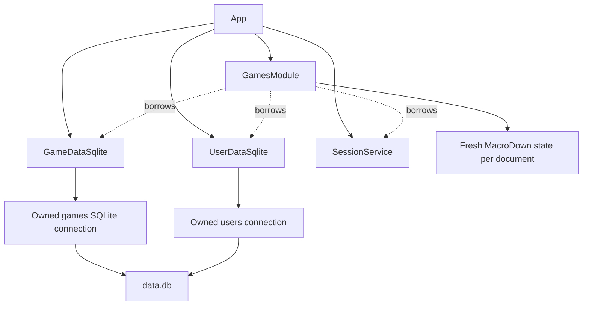

# Game tracking module

Status: proposed implementation design.

Requirements: [prd-games.md](../prd-games.md).
Architecture baseline: [module design](design-0-modules.md) and the current
`App`, `SessionService`, user storage, and weekly module implementations.

## 1. Scope and decisions

Implement the tracking portion of the games module under `/games/`.
Each account has an independent public table. Visitors can read every
tracking field, including notes. An authenticated owner can add, edit,
rename, and delete records through dialogs. Notes use MacroDown. A temporary
command-line mode imports one exported Tracker CSV into one existing user.

Reviews, journals, screenshot uploads, game-name suggestions, replay
sessions, and daily activity tracking are deferred. Do not create their
tables, endpoints, buttons, or placeholder tabs in this release. In
particular, neither the tracking model nor its dialog has a Review field.

The principal implementation decisions are:

- Add `GamesModule` and `GameDataInterface` alongside the weekly module.
- Keep one tracking row per user and normalized game name, enforced by SQL.
- Store platforms as a JSON array in the tracking row, so editing a game
  requires one atomic statement rather than several child-table writes.
- Preserve missing values explicitly. Zero hours is a recorded value.
- Return the complete table and sort its existing rows in the browser.
- Share validation between HTTP writes and the CSV importer.
- Import validated rows without overwriting existing games; report
  duplicates, and make a repeated import safe.

These choices are design proposals where the PRD does not specify behavior.
The source is
[MetroWind's Unfair Game Reviews](https://docs.google.com/spreadsheets/d/1BK6kReBhj3xyfv-4wJdDBMUCZeZwdjLU3FxTdDkFL1Y/edit).
Its README, Tracker headers, dropdown validation, date formats, and populated
Tracker rows were inspected through Google Drive on 2026-10-08. Only README
and Tracker are inputs to this design; Reviews remains outside its scope.

## 2. Existing system and integration boundaries

The service is C++23, using cpp-httplib, inja, nlohmann/json, SQLite, and
cxxopts. `App` owns backends and modules and registers their routes before
listening. User and weekly storage each own a separate connection to
`<data-dir>/data.db`. `Users.name` is the existing account key. Identity
comes from OpenID Connect, via `SessionService`; games introduces no account
management or new authentication scheme.

`WeeklyPost::render()` currently uses cmark. It does not satisfy the games
requirement to use MacroDown. Leave weekly rendering in its current module
and introduce an explicit games renderer. Every Markdown field subsequently
added to games must use that renderer too.

Extend `App` with owned game storage and an owned `GamesModule`. Production
startup opens a third configured connection, initializes `Users` before
the games schema, then composes the games module. Extend the injected
`App::create()` path to accept fake game storage. Update existing test
callers with an empty fake rather than opening a real database implicitly.

Declare game storage before the module members so borrowers are destroyed
first. The module borrows configuration, game storage, user storage, and
sessions. It owns its template environment. Delete its copy and move
operations because registered callbacks capture its address. Use
`unique_ptr` for ownership and references for required dependencies.



Keep `/` and its weekly landing policy unchanged. Add a Games link for the
signed-in account and a link from a user's weekly page to that same user's
games. Add the corresponding Weeklies link on the games page. These links
provide navigation without introducing a public user directory.

## 3. Domain model and validation

### 3.1 Record shape

Use `GameRecord` for persisted records and `GameInput` for proposed field
values. `GameRecord` contains a positive `int64_t id` and a `GameInput`.
An ID identifies a tracking record, not a globally catalogued game. Do not
put the name in an edit/delete URL: names can change and contain punctuation.
There is no shared game catalogue in this release.

| Field | C++ representation | Empty representation | Rule |
| --- | --- | --- | --- |
| Name | `std::string` | Prohibited | Trim outer ASCII whitespace; nonempty |
| Platforms | `std::vector<std::string>` | Empty vector | Codes from `PLATFORM_CHOICES`; unique |
| Status | `GameStatus` | Prohibited | Exactly one of five choices |
| Completion | `std::optional<GameCompletion>` | `nullopt` | Independent of status |
| Hours | `std::optional<std::string>` | `nullopt` | Exact nonnegative decimal |
| Start date | `std::optional<std::chrono::year_month_day>` | `nullopt` | Valid calendar date |
| End date | Same as start date | `nullopt` | Independently optional |
| Notes | `std::optional<std::string>` | `nullopt` | Raw MacroDown source |

Use uppercase enum members and explicit conversion tables:

| `GameStatus` | Stored/API code | Display label |
| --- | --- | --- |
| `NOW_PLAYING` | `now_playing` | Now Playing |
| `QUEUE` | `queue` | Queue |
| `SHELVED` | `shelved` | Shelved |
| `DONE` | `done` | Done |
| `WISHLIST` | `wishlist` | Wishlist |

| `GameCompletion` | Stored/API code | Display label |
| --- | --- | --- |
| `NOT_STARTED` | `not_started` | Not Started |
| `PARTIAL` | `partial` | Partial |
| `FINISHED` | `finished` | Finished |
| `PLATINUM` | `platinum` | Platinum |
| `ENDLESS` | `endless` | Endless |

Do not encode enum ordinals in storage: changing declaration order must not
reinterpret saved records. Retain these meanings from the
[spreadsheet README](https://docs.google.com/spreadsheets/d/1BK6kReBhj3xyfv-4wJdDBMUCZeZwdjLU3FxTdDkFL1Y/edit#gid=619044953),
also suitable as help text in the dialog:

- Now Playing: actively playing the game.
- Queue: intend to play in the near future, roughly within the next year.
- Shelved: previously played; no near-term plan to continue, but may return.
- Done: no intention to play the game anymore.
- Wishlist: not yet purchased; a reminder to consider buying later.

These describe user intent rather than an enforced state machine. In
particular, Done does not imply Finished, and Wishlist does not forbid
recorded hours. The source includes a Wishlist record with hours and a
Now Playing record with Finished completion.

### 3.2 Names and deduplication

`normalizeGameName()` trims ASCII space, tab, CR, and LF at both ends and
maps ASCII `A` through `Z` to lowercase. The stored display name retains
case. Preserve all internal whitespace, punctuation, accents, and other
UTF-8 bytes. Reject invalid UTF-8 and NUL in names and other text inputs.

Thus ` Hades ` and `hades` conflict for one user. `Hades II` and `Hades  II`
remain different. This intentionally simple policy meets the PRD without
fuzzy matching, title lookup, or a Unicode collation dependency. Apply the
same normalization to creates, renames, CSV rows, and duplicate diagnostics.

A duplicate create or rename returns a conflict; it never merges or
overwrites records. Two different users may both track `Hades`.

### 3.3 Platforms

Define `PLATFORM_CHOICES` as a compile-time list of code/label pairs in
`game_choices.hpp`. Use it to generate dialog checkboxes, validate input,
render labels, and interpret CSV platform labels. No two-selection cap
exists: a record can select any subset of the list.

The initial list is the validation list observed in Tracker B2 and C2:

| Stable code | Display and CSV label |
| --- | --- |
| `pc` | PC |
| `switch` | Switch |
| `switch_2` | Switch 2 |
| `ps_5` | PS 5 |
| `emulator` | Emulator |

Keep codes stable after release, even if labels change. Deduplicate repeated
input codes and store selections in this declaration order, giving consistent
output regardless of checkbox or CSV column order. Unknown codes are errors.
CSV maps these exact labels to codes; no additional aliases are needed for
the inspected source. Tracker includes PC plus PS 5 and Switch plus Switch 2
records, providing real examples for the two-column merge.

### 3.4 Hours, dates, and notes

Hours accept an ASCII decimal matching `[0-9]+(\.[0-9]+)?`. Empty text maps
to absent hours; `0` maps to present hours. Reject negative values, exponent
notation, NaN, infinity, partial parses, and grouping separators in the
normal HTTP contract. Canonicalize leading integer zeros and trailing
fraction zeros; `000.500` becomes `0.5`. Store the resulting decimal as
text, avoiding binary floating-point rounding and arbitrary precision loss.
No gameplay-hour ceiling or rounding rule is introduced.

Dates use exact `YYYY-MM-DD`, years 0001 through 9999, and calendar validation
through `year_month_day::ok()`. They are calendar days, not timestamps;
there is no timezone conversion. Either may be empty. Do not auto-fill or
clear dates when status changes, and do not require an ordering between
them: the PRD requires preservation and defines no ordering validation.

Notes retain their original source, including line breaks and whitespace.
Only a zero-length string becomes `nullopt`; whitespace-only source is
preserved. Do not trim Markdown. Other optional scalar form values can have
outer ASCII whitespace trimmed before parsing. An empty completion remains
absent, distinct from Not Started.

`validateGameInput()` performs these rules and returns all field errors
together. Status and completion never constrain each other. In particular,
Now Playing plus Finished is valid. A game with only a name and status is
valid. Browser checks aid input; server and importer validation are final.

## 4. SQLite schema and storage operations

### 4.1 Schema

Create the following table with `CREATE TABLE IF NOT EXISTS` at startup:

```sql
CREATE TABLE IF NOT EXISTS GameTracking
(
    id INTEGER PRIMARY KEY AUTOINCREMENT,
    user_id INTEGER NOT NULL REFERENCES Users(id),
    name TEXT NOT NULL CHECK(length(name) > 0),
    name_key TEXT NOT NULL CHECK(length(name_key) > 0),
    platforms TEXT NOT NULL DEFAULT '[]',
    status TEXT NOT NULL CHECK(status IN
        ('now_playing', 'queue', 'shelved', 'done', 'wishlist')),
    completion TEXT CHECK(completion IN
        ('not_started', 'partial', 'finished', 'platinum', 'endless')),
    hours TEXT,
    start_date TEXT,
    end_date TEXT,
    notes TEXT,
    UNIQUE(user_id, name_key)
);
```

`AUTOINCREMENT` prevents a deleted ID from being reused for a different
record; a stale edit dialog must not accidentally target a later game.
The extra allocation overhead is acceptable for a personal tracker.

Serialize platforms using nlohmann/json. SQLite treats the value as TEXT;
this design does not require the SQLite JSON extension. On read, validate
that the array contains unique known strings. Treat malformed persisted
values as storage errors rather than silently displaying incomplete data.
The C++ validator enforces decimal/date syntax and normalized-name equality;
SQL enforces required values, enum membership, and race-safe uniqueness.

Nullable scalar values bind as SQL NULL and read as `std::optional<T>`.
Extend the existing SQLite wrapper with `nullopt` and optional binding;
it already supports optional result columns. Do not substitute zero or an
empty string for NULL. Parse persisted hours and dates before exposing them
to callers, so corrupt data cannot become apparently valid records.

Enable `PRAGMA foreign_keys = ON` on the games connection and check success.
Do not change journal mode or settings on unrelated existing connections.
User deletion has no application route; future deletion support must account
for all feature tables, rather than assuming this connection controls all
writers. Keep existing Users and Weeklies definitions intact.

### 4.2 Interfaces and errors

`GameDataInterface` exposes these operations, returning `mw::E<T>`:

| Method | Result type inside `mw::E` | Meaning |
| --- | --- | --- |
| `listGames(username)` | `std::vector<GameRecord>` | All rows, default name order |
| `getGame(username, id)` | `std::optional<GameRecord>` | One owner-scoped row |
| `createGame(username, input)` | `GameRecord` | New row with generated ID |
| `updateGame(username, id, input)` | `GameRecord` | Full field replacement |
| `deleteGame(username, id)` | `bool` | Whether one row was removed |

All methods take the username explicitly. All statements resolve the owner
through `Users` and include that owner in their predicate. No implementation
method updates or deletes by record ID alone. The storage layer validates
inputs too, so the CLI cannot bypass the rules enforced for HTTP callers.

Use custom error structs carried by `mw::Error`: `GameValidationError`
contains a field-to-message map and `msg`; `DuplicateGameError` identifies a
name conflict; `GameNotFoundError` identifies a missing owner-scoped record.
Unexpected database failures remain runtime/storage errors. Do not classify
errors by matching English text.

The project currently has a separate global `E<T>` and error variant.
Do not replace them throughout the application. New games code uses libmw's
`mw::E<T>` and converts legacy errors at calls to user storage, sessions,
SQLite, and App creation. These narrow adapters preserve messages and HTTP
codes where present. Keep game-specific errors typed until the HTTP/CLI
boundary maps them to responses or diagnostics.

### 4.3 SQL behavior and concurrency

`GameDataSqlite` owns its configured connection. Reuse the existing SQLite
wrapper rather than adding a second connection framework. The inspected
libmw SQLite implementation unconditionally enables WAL on open; using it
here would change persistent journal mode for the existing application.
Use libmw error utilities now and defer database-wrapper consolidation.

For a new authenticated account, HTTP creation calls `users.ensureUser()`
before insertion. The importer requires an existing user. Game storage
itself never creates an unknown user. A failed game insert may leave an
empty user account after an HTTP ensure; no cross-connection transaction is
claimed or needed for that harmless case.

Create uses `INSERT ... SELECT ... FROM Users WHERE name = ? RETURNING id`.
Update uses `UPDATE ... WHERE id = ? AND user_id = (SELECT id FROM Users
WHERE name = ?) RETURNING id`. Delete uses the same owner predicate and
`DELETE ... RETURNING id`. Fetch the created/updated row by owner and ID if
the statement does not return all columns. Prefer returning all columns in
the write statement to avoid another request deleting it before that fetch.
Consume every returned row and finish the statement before reporting success.
The existing SQLite minimum already supports
[RETURNING](https://sqlite.org/lang_returning.html).

Add a structured `SQLiteError` with `code`, `extended_code`, and `msg` to the
existing wrapper's error variant, preserving its existing `errorMsg()`
contract. Capture the statement's actual SQLite return code immediately.
Use `sqlite3_extended_errcode()` only while that connection error state is
protected from another request; alternatively enable extended result codes
at connection setup and classify the returned step code directly. The
latter is preferred. Handle extended codes in the wrapper's stepping loop
using their primary code for the switch. Convert only
`SQLITE_CONSTRAINT_UNIQUE` for this table's name key to a duplicate error;
other constraint failures must remain visible as implementation/data errors.

The database unique constraint is authoritative. A preflight duplicate query
alone is insufficient because concurrent creates can both pass it. Use
normal constraint-aborting INSERT/UPDATE, never `INSERT OR REPLACE`, which
can delete an existing record. See
[SQLite conflict handling](https://sqlite.org/lang_conflict.html).

All ordinary writes are one statement containing platforms and all scalar
values. SQLite makes each statement atomic; failed renames retain the old
record and failed edits cannot save only some platforms. Use fresh bound
statements per call, the existing FULLMUTEX connection mode, and the existing
five-second busy timeout. Serialized SQLite calls do not make several SQL
statements a transaction; see
[SQLite threading modes](https://sqlite.org/threadsafe.html).

Concurrent edits to the same existing game use last successful write wins.
Optimistic versions and conflict-resolution UI are outside this PRD. A
concurrent deletion results in not found, and an edit never recreates a row.
Default list order is `ORDER BY name_key, id`; UI sorts never affect storage.

## 5. HTTP contract

### 5.1 Routes

| Method | Path | Access and result |
| --- | --- | --- |
| GET | `/games/` | Redirect signed-in user to their table; guest to `/login` |
| GET | `/games/:username` | Public HTML table, 200 |
| GET | `/games/:username/records/:id` | Public JSON record for edit population |
| POST | `/games/:username/records` | Owner creates a record, 201 JSON |
| PUT | `/games/:username/records/:id` | Owner replaces a record, 200 JSON |
| DELETE | `/games/:username/records/:id` | Owner deletes a record, 204 |

Register `/games` as a 308 redirect to `/games/`. A known user without
games gets an empty table. An unknown user gets 404; public reads never
create users. A valid account visiting its own table may be materialized
with `ensureUser()` so a first-time games user can see an empty tracker.
Do that only when the validated identity equals the requested username.

Encode usernames as individual URL path components in a new `gamesURL()`
helper. Do not concatenate unescaped usernames or use the current generic
form encoder blindly: inspect its treatment of spaces and slash first.
Record IDs must parse completely as positive signed 64-bit integers.

### 5.2 Request and response payloads

Create and update accept `application/json` with this complete shape:

```json
{
    "name": "Hades",
    "platforms": [],
    "status": "now_playing",
    "completion": "finished",
    "hours": "42.5",
    "start_date": "2026-09-01",
    "end_date": null,
    "notes": "Finished the main story; **still playing**."
}
```

On create, omitted optional keys become empty values. On PUT, require all
eight field keys, using `[]` and `null` to clear optional values. This makes
replacement explicit and catches a frontend accidentally omitting fields.
Empty optional strings normalize as described in section 3. Reject unknown
keys, wrong types, numeric JSON hours, unknown enum codes, and duplicate
scalar query/body interpretations. Names remain strings with no lookup.

Successful record JSON contains `id` as a decimal string and the normalized
input fields, including raw notes. String IDs avoid JavaScript's integer
precision ceiling. Do not use HTML rendering as the edit source. A response
may be `{ "game": { ... } }`; it has no Review or private tracking fields.
The table reload obtains rendered notes after a successful write.

Errors use a stable envelope, for example:

```json
{
    "error": {
        "code": "validation_failed",
        "message": "Correct the highlighted fields.",
        "fields": {"status": "Choose a status."}
    }
}
```

Map malformed JSON/IDs to 400, unsupported content type to 415, invalid
field values to 422, missing authentication to 401, a different logged-in
owner or invalid request origin to 403, missing user/record to 404, and a
duplicate name to 409. Map remaining storage/rendering failures to 500 with
a generic response and detailed server logging. Do not disclose SQL, token
values, or raw notes in logs. An already-deleted ID returns 404.

Set an initial games-body limit of 1 MiB before JSON parsing, including a
bounded content receiver where required by the pinned httplib version.
Return 413 for oversized writes. Avoid reducing the body limit for weekly
routes. This transport limit also bounds large individual field values.

### 5.3 Authentication and request flow

For each write:

1. Validate the session using `SessionService`.
2. Accept VALID and REFRESHED, and reject INVALID or failed validation.
3. Compare `session.user.name` exactly with the route username. Never trust
   a username, `user_id`, or `owner` supplied inside JSON.
4. Check the Origin header against the origin in `config.url_prefix`.
   Reject missing, `null`, or mismatched Origin on write requests. The
   browser's same-origin fetch requests supply this header. Do not enable
   cross-origin writes or wildcard CORS. This is a games-specific contract;
   there is no need for a public HTTP automation API in this release.
5. Validate content type, size, JSON shape, and field values.
6. Perform an owner-scoped storage operation and map its result.
7. Apply replacement cookies for a REFRESHED session on games responses,
   including field errors, so validation retries do not repeat refreshes.

Read handlers attempt session validation only to choose owner controls and
navigation. Invalid or unavailable authentication does not prevent public
reads. Hide mutations for visitors, but enforce every check again on the
server. Shared-session changes must not alter existing weekly semantics.

Games HTML and JSON include authentication-dependent responses and should
use `Cache-Control: no-store`. Record JSON remains readable by any visitor;
no authentication decision hides notes or any other tracking field.

## 6. Table, dialogs, and sorting

Render `templates/games.html` using inja and use `statics/games.js` for
behavior. Use semantic `<table>`, `<thead>`, and `<tbody>` elements. Columns
are Name, Platforms, Status, Completion, Hours, Start date, End date, Notes,
and owner-only Actions. Render absent values as visually empty cells; expose
an accessible “Not recorded” description if needed. Render zero as `0`.
Keep the complete table, including notes, public and horizontally scrollable
on small screens. Wrap long notes instead of hiding their content.

Every data header contains a keyboard-operable sort button. The Actions
header does not sort. Store typed sort keys in escaped data attributes;
never sort by rendered HTML. Notes sort by raw source. Platforms sort by
their joined display labels, matching the canonical platform order.

Sorting algorithm:

1. Read the clicked column. A different column starts ascending; clicking
   the same column toggles direction.
2. Build row/key pairs from existing DOM rows.
3. Compare missing values after present values in both directions. Compare
   text using one `Intl.Collator` instance and dates as ISO strings.
4. Compare hours exactly: compare canonical integer-part lengths, then
   integer digits, then fractional digits padded on the right with zeros.
   Do not convert decimal strings to `Number`.
5. Compare status and completion using declaration order from section 3;
   empty completion remains last. Use the original table-row index as the
   tie-breaker for equal keys, yielding deterministic stable ordering.
6. Append the sorted rows to the existing `<tbody>` and update `aria-sort`
   on the active header. No request or storage write occurs.

Refreshing the page restores the default order. Do not use cookies,
localStorage, URL parameters, or database columns for sort persistence.

Use one add/edit `<dialog>` with labelled fields, platform checkboxes,
explicit blank completion, decimal text input with `inputmode="decimal"`,
date controls, a notes textarea, Save, and Cancel. `showModal()` provides
modal behavior; see the
[dialog API](https://developer.mozilla.org/en-US/docs/Web/API/HTMLDialogElement).
Name and status are the only required controls. Do not preselect a platform
or silently convert absent completion to Not Started.

Add opens an empty form. Edit fetches the public record JSON and assigns
raw values through DOM properties such as `.value` and `.checked`. It never
copies rendered notes into the textarea. Save sends JSON, disables repeated
submissions, and retains the open dialog and entered values on errors.
Display server field errors beside their controls and focus the first error.
On success reload the table page; resetting sort is consistent with its
non-persistent behavior. Cancel or Escape restores focus to the opener.

Delete opens a confirmation dialog naming the game as text. Confirm sends
DELETE, then reloads after 204. Cancellation sends no request. A failed
delete leaves the row visible with an error. Edits and deletes never use
GET requests. Basic table content remains readable without JavaScript;
dialogs and sorting require it. No Bootstrap or new frontend framework is
needed. Scope additional CSS beneath the games page container.

## 7. MacroDown integration and safe output

The inspected local checkout at `~/programs/macrodown` exposes
`macrodown::MacroDown`, `parse(source)`, and `render(*root)`, and exports
`MacroDown::MacroDown` as its CMake target. Its
[upstream repository](https://git.xeno.darksair.org/macrodown.git) is named
in the local README. Pin a reviewed commit in CMake, rather than a moving
branch. Use `FETCHCONTENT_SOURCE_DIR_MACRODOWN` for local development;
do not hard-code a home-directory dependency into production builds.

Provide `renderGameMarkdown(source)` returning `mw::E<std::string>`:

1. Construct a fresh MacroDown processor for each document.
2. Parse the complete raw source into its tree.
3. Render through MacroDown, preserving supported macro syntax.
4. Return rendered HTML as data, never as an implicitly trusted template
   fragment. Normalize dependency failures at this single boundary.

Fresh instances matter because `%def` mutates the evaluator. A shared
instance could leak macros between games or users and race across requests.
Do not implement games preview with the existing CommonMark browser script.
Live preview is not required for this release and is omitted.

The current MacroDown evaluator returns text verbatim and expands link/image
attributes from macro arguments. Its output is not an HTML sanitization
boundary. Use a pinned, locally served
[DOMPurify distribution](https://github.com/cure53/DOMPurify) for browser
insertion. In the server-rendered page, put rendered HTML inside a hidden
element as explicitly HTML-escaped text. The external games script reads
`textContent`, sanitizes it, and only then inserts it into the visible notes
cell. Raw notes appear as escaped plain text until enhancement completes.
Never place unsanitized output directly inside live HTML, a script block,
an attribute, or a client `innerHTML` assignment.

Use an explicit allowlist: paragraph/div/span, headings, lists, blockquote,
pre/code, emphasis/strong, links, horizontal rules, breaks, tables, and
images; attributes are limited to href, src, alt, title, and table spans.
Allow HTTP(S), fragment links, and ordinary relative URLs; optionally allow
mailto on links only. Reject protocol-relative URLs, all other schemes,
event handlers, styles, scripts, frames, forms, SVG, MathML, and DOM ID/name
attributes. Keep DOMPurify's own URI filtering active as well. If scripts
or sanitizer loading fails, leave the escaped source visible. Serve these
assets from `/statics/`, without a runtime CDN requirement.

Do not assume inja escapes interpolation by default: explicitly escape
every name, label, raw note, rendered-note carrier, and attribute value.
This includes `</textarea>` in raw edit content and HTML in game names.
DOMPurify applies to MacroDown output only; ordinary values use text APIs.

The inspected MacroDown API has no visible recursion or expansion budget.
Before release, add or select a pinned MacroDown revision that bounds parse
nesting, evaluation depth, macro invocation count, and cumulative generated
bytes. Initial limits are depth 128, 100,000 evaluation steps, and 4 MiB
generated output per document. Every append must check the remaining
output budget before allocating the combined string. Test recursive macros
and exponentially expanding macros, not just long input strings. A timeout
around an uncancellable C++ thread is insufficient. Treat this as a concrete
dependency prerequisite; the adapter cannot promise limits absent in the
library. A narrow catch for documented dependency exceptions is acceptable
at this boundary; ordinary games failures use `mw::E<>`.

Render failure for one stored note displays an escaped source fallback and
a small rendering-error indicator for that cell; other rows still load.
Keep original notes unchanged in SQLite and JSON. Imports validate source
encoding but need not render it, so renderer changes cannot corrupt or
discard migrated source.

## 8. Temporary Tracker CSV import

### 8.1 CLI and startup branch

Add these temporary cxxopts options:

```text
nsweekly --config /etc/nsweekly.yaml \
    --import-games-csv /tmp/tracker.csv --import-games-user mw
```

Both import arguments are required together. Help exits before any
initialization. Load the same configuration to locate `data.db`, then
branch to import mode before `App::create()`. Import mode opens only user
and games storage, initializes their schemas, resolves the specified
existing user, imports, prints a summary, and exits. It must not contact
OpenID discovery, construct HTTP modules, load templates, mount assets,
create the hard-coded `mw` startup user, or start listening.

An unknown target user is a command error. The user argument is an existing
storage account key, not a display name guessed from CSV. Import is a local
administrator operation and does not require HTTP session cookies.

Use exit 0 for success, including duplicate skips; 2 for bad CLI usage,
unknown user, unreadable/invalid CSV, or invalid rows; 3 for configuration
failure as today; and 4 for storage failure. These meanings apply to the
new import branch without renumbering normal server startup errors.

### 8.2 CSV parsing and column mapping

Read UTF-8 CSV with optional UTF-8 BOM, a header, and comma separators.
Support LF and CRLF records, quoted commas, doubled quotes, and multiline
quoted notes. Use a proper state machine, not `getline()` plus comma split.
Report logical record number and physical starting line for errors. Skip
entirely blank records, but reject a nonblank row missing name or status.
Follow the interchange conventions in
[RFC 4180](https://www.rfc-editor.org/rfc/rfc4180).

Map columns by header rather than spreadsheet position. Trim header
whitespace and match the exact headings observed in Tracker A1:J1. Reject
duplicate canonical headers. Accept `Name` as an explicit additional alias
for `Game` to support a PRD-named fixture; both appearing is a duplicate
canonical header error. The source mapping is:

| Source column | Destination | Handling |
| --- | --- | --- |
| Game | name | Required; shared normalization |
| Platform | platforms | First optional platform label |
| 2nd Platform | platforms | Second optional platform label |
| Status | status | Exact label-to-code mapping |
| Completion | completion | Empty stays absent |
| Hours | hours | Empty stays absent; zero is retained |
| Start date | start_date | Empty stays absent |
| End date | end_date | Empty stays absent |
| Notes | notes | Preserve decoded cell text |
| Review | Nothing | Ignore all content |

Only name and status columns are required. Missing optional columns mean
empty values. Unrecognized extra columns are ignored with their header
names listed in the summary; the importer must never import another sheet's
review data. Duplicate headers and inconsistent nonblank record widths are
structural errors. A malformed quote anywhere is an error, even in Review,
because reliable column boundaries require parsing the whole record.

Combine both platform cells, omitting blank values and removing duplicates;
the same platform in both columns produces one selection. Use verified
label aliases from section 3. Unknown platforms/status/completion fail
validation instead of being silently dropped or guessed.

Tracker uses locale `en_US`, but its G/H date columns explicitly format dates
as `yyyy-mm-dd`. Observed cells include `2020-12-20` and `2023-02-22`.
Import those displayed/exported ISO strings with the shared calendar-date
parser, rather than interpreting underlying Google Sheets serial numbers.
Observed hours are plain ungrouped decimal integers such as `138`, `32`, and
`380`; the shared decimal parser also accepts fractional values. No locale
guessing, serial-date conversion, grouping normalization, or rounding is
required. Unsupported formats fail with a row/column diagnostic.

For example, the observed BioShock row has blank hours and both dates blank;
Outer Wilds has an end date without a start date. Keep those omissions.
The source's Review cells contain calculated display values; ignore them
regardless of whether CSV contains Pending, Reviewed, or an empty cell.
Some Sheets API rows omit trailing empty cells; an exported CSV fixture
should still exercise a full header-width row with empty trailing fields.

### 8.3 Validation, duplicates, and failure behavior

Import proceeds in two phases:

1. Read and structurally parse the entire CSV.
2. Map rows and apply the same `validateGameInput()` as HTTP writes. Collect
   errors with row, column, offending non-sensitive value, and explanation.
   For notes report the location/error only, avoiding full note dumps.
3. If any row is invalid, exit 2 without inserting any game records. Schema
   initialization is the only allowed database change at this stage.
4. Deduplicate normalized names within the file. Retain the first valid
   occurrence; report later occurrences and their original row numbers.
5. Insert each remaining record with the ordinary create operation. Existing
   per-user names are skipped and counted, without overwriting any field.
   A concurrent duplicate receives the same skip treatment.
6. Print input, blank, inserted, duplicate-in-file, and duplicate-in-database
   counts, plus ignored columns. Exit 0 if no storage failure occurred.

This policy makes rerunning a completed migration harmless. To correct an
existing game's data, use the owner edit dialog rather than an implicit
import upsert. The same title in another user's tracker is never a duplicate.

Do not introduce a multi-statement transaction on the shared HTTP connection.
The importer runs before serving and uses one atomic create per record. If
a storage failure happens after some inserts, stop immediately, exit 4,
and clearly report how many inserts committed and the failing record.
There is no file-wide rollback promise. Correcting the failure and rerunning
skips those committed rows and inserts the remainder. Validation failures,
by contrast, are detected before the first record insert.

Read-only validation and a backup are part of the documented operator
migration sequence. They do not require a permanent HTTP upload workflow
or extra user-facing feature. Remove the temporary flags and importer after
the migration has been verified; keep domain validation and storage tests.

## 9. File and dependency plan

| File | Responsibility |
| --- | --- |
| `src/game.hpp/.cpp` | Record types, normalization, parsing, validation |
| `src/game_choices.hpp` | Stable platform/status/completion code-label lists |
| `src/game_data.hpp/.cpp` | Storage interface, schema, SQLite implementation |
| `src/games_module.hpp/.cpp` | Routes, ownership checks, JSON, template context |
| `src/game_markdown.hpp/.cpp` | MacroDown adapter and error boundary |
| `src/game_import.hpp/.cpp` | Temporary CSV mapping and import report |
| `src/csv_reader.hpp/.cpp` | CSV record/field state machine |
| `templates/games.html` | Public table and owner dialogs |
| `statics/games.js` | Dialogs, fetches, safe note rendering, local sorting |
| `statics/dompurify.min.js` | Pinned sanitizer distribution and license |

Add component tests adjacent to their components, matching the current
repository layout. Extend route helpers, App composition, `main.cpp`, CMake
source lists, navigation templates, scoped stylesheet rules, package assets,
and README deployment/migration instructions.

Add pinned MacroDown and libmw dependencies. Link `MacroDown::MacroDown`
and `mw::mw`; keep libmw optional subsystem builds disabled for this change.
The inspected libmw target does not export its public include path, so add
`${libmw_SOURCE_DIR}/includes` explicitly for `<mw/error.hpp>` in both
NSWeekly targets, or use a reviewed upstream target fix. Do not assume the
include path appears transitively. Use libmw utilities where applicable;
its inspected tree has no CSV utility, so the small CSV reader is justified.
Keep the existing cmark dependency for weekly rendering.

Document pinned revisions and preserve dependency licenses. Package installs
must include the new template/scripts and sanitizer license. Changes remain
inside this repository; any needed MacroDown budget implementation is a
separate reviewed dependency change, not an undocumented local-only patch.

## 10. Template context and browser data boundaries

The page context contains `username`, `session_user`, `is_owner`, the
games/weekly/login URLs, code-label choices, and `games`. Each row contains
string `id`, display values, typed sort keys, escaped raw notes, and escaped
MacroDown-produced HTML for the inert carrier. Dates remain ISO strings;
optional values remain null until formatting chooses an empty cell.

Do not serialize the whole context directly into executable JavaScript.
Use escaped HTML data attributes for small scalar keys and inert escaped
text nodes for notes. Edit fetches obtain the record JSON when needed,
avoiding a second giant inline JSON copy of all notes. Scripts attach
events through named functions rather than inline event-handler attributes.

The public table must not fail just because optional session validation
fails or one note fails rendering. A storage failure is different: show an
error response rather than presenting a misleading empty tracker.

## 11. Implementation order

1. Capture a small Tracker-shaped fixture using the verified platform list,
   status meanings, headings, and ISO dates in this design. Include observed
   blank/end-only/two-platform cases and synthetic zero/multiline cases.
   Do not claim synthetic examples were present in the source.
2. Pin MacroDown/libmw; implement and verify MacroDown budgets. Add the
   renderer adapter and locally served sanitizer with malicious-output tests.
3. Implement record types, choices, exact decimal/date parsing, shared
   validation, and normalized name keys.
4. Add SQLite optional binding and typed error codes. Implement the games
   schema and owner-scoped CRUD with isolated database tests.
5. Wire storage/module ownership into production and injected App creation.
   Preserve current root, authentication, and weekly behavior.
6. Implement public table/record routes, then owner write routes with the
   JSON contract, Origin checks, session refresh, and error mapping.
7. Add templates, navigation, dialog behavior, safe note enhancement, and
   deterministic browser sorting.
8. Implement the separate import startup branch, CSV reader/mapping,
   validation-before-insertion, duplicate reporting, and exit behavior.
9. Complete integration/manual checks and update deployment/migration docs.

Each step should leave the project buildable. No step requires editing or
opening the repository's untracked `data.db` or `nsweekly.yaml`; use fixture
configuration and temporary databases for development and verification.

## 12. Test plan

### 12.1 Domain and storage

- Required-only input succeeds; empty required values and unknown choices
  fail. Every status/completion pair succeeds, including Finished while
  Now Playing. Clearing each optional field round-trips as absent.
- Test names with outer whitespace, ASCII case differences, internal double
  spaces, accents, punctuation, and distinct users. Reject malformed UTF-8.
- Test no platforms, three or more platforms, repeated platforms, and the
  full configured list. Unknown platforms fail HTTP and import validation.
- Test absent hours versus `0`, fractional hours, canonicalization, very
  precise decimals, negatives, exponent forms, trailing junk, and NaN.
- Test leap days, invalid dates, start-only/end-only dates, both empty, and
  dates before/after each other without automatic correction.
- Round-trip multiline MacroDown source exactly, including whitespace and
  braces. Raw input must remain available after a render failure.
- Create schema on both empty and legacy weekly databases. Confirm Users
  and Weeklies and their data are unchanged.
- Test insert/edit/rename/delete, duplicate create/rename, missing IDs,
  cross-owner record IDs, foreign-key enforcement, and no reuse of a deleted
  ID. Failed edits preserve every field, including platforms.
- Run competing same-name inserts on separate connections. Exactly one
  succeeds; the other gets a typed duplicate error. Ensure completed writes
  are visible to other connections without connection-wide last-ID races.

### 12.2 HTTP and rendering

Use fake auth/game storage for handler tests, plus real loopback routes and
temporary database files for integration tests. Assert guest public access,
all fields visible, correct empty-state behavior, login redirection, owner
controls, and 401/403/404 distinctions. Forged body ownership and another
user's numeric ID must never modify data. Test valid and refreshed sessions,
provider failure, cookies on games responses, and same-origin/missing/null/
foreign Origin cases. Exercise malformed JSON, all payload types, partial
PUT, name collisions, oversized bodies, and generic storage error responses.

MacroDown tests must include a macro-specific input, not just Markdown that
cmark could also render. Check document-local macro definitions, independent
requests, concurrent renders, invalid source, and budget failures. Verify
raw HTML, quote-breaking attributes, `javascript:` URLs, malicious macro
output, `</textarea>`, `</script>`, and hostile names cannot execute in the
browser. Test failed sanitizer loading leaves only escaped text.

### 12.3 Browser behavior

Use browser automation or a repeatable manual fixture for these DOM-specific
checks; C++ response tests alone cannot prove them:

- Add/edit dialogs populate raw values, retain input after errors, and clear
  previously recorded optional values. Cancel/Escape save nothing.
- Selecting more than two platforms survives save/reload. Delete requires
  confirmation; failed deletion leaves the row intact.
- Sort every data column both ways. Include equal keys, missing values,
  zero and fractional hours, very long exact decimals, Unicode names,
  several platforms, and Markdown notes. Check `aria-sort`, keyboard access,
  empty table, and stable ties.
- Confirm sorting sends no network requests and refresh restores default
  ordering. Check mobile horizontal scrolling, focus, and readable notes.
- Confirm notes are sanitized before live DOM insertion, and the page still
  exposes safe public content with JavaScript disabled.

### 12.4 CSV and process behavior

Fixtures cover BOM, LF/CRLF, reordered headers, omitted optional columns,
ignored Review/extra columns, escaped quotes, multiline notes, blank rows,
malformed quoting, invalid encoding, duplicate headers, and wrong widths.
Use the verified `Game` header, ISO dates, and plain hours in source fixtures;
test `Name` alias handling and reject simultaneous Game/Name headers.
Test required fields, blank completion/dates/hours, numeric zero, platform
combination/deduplication, and all approved labels.

Test duplicate names within CSV, against the target user's database, and in
another user's database. Reimport twice and verify the second run inserts
nothing and changes no existing values. One invalid late row must prevent
all game inserts. Inject a storage failure after N rows and verify partial
counts, nonzero exit, and successful completion on rerun.

Launch the production binary with import arguments and an unreachable OpenID
URL. Import must succeed without provider traffic or any listening port.
Test paired flags, help, unknown user, missing file, bad configuration,
storage failure, output counts, exit codes, and no template dependency.

## 13. Verification, rollout, and migration removal

For implementation verification, configure and run:

```sh
cmake -S . -B build
cmake --build build -j24
ctest --test-dir build --output-on-failure
python3 tests/smoke_test.py build/nsweekly
```

Extend the smoke test with a games CRUD scenario and an isolated CLI-import
scenario. Run browser checks against fixture accounts and a temporary
database. Existing weekly HTML, auth, route, and storage tests must continue
passing. This design-only change does not require compiling the application.

Deployment creates only the new table. Before a real migration, stop the
service and back up its SQLite file with a consistent SQLite backup or a
closed-database copy. Export only Tracker to CSV, inspect the real headings
and value formats, run the importer for the intended existing username,
and inspect inserted/duplicate counts. Then restart and compare table totals
and representative notes, platforms, dates, zero hours, and blank hours
against the export. Preserve the original CSV and backup until verified.

If deployment must roll back, the previous binary can ignore GameTracking;
keep the table and its data rather than automatically dropping it. The
importer never changes existing game rows, so an import rerun is preferable
to a restore after an ordinary partial import failure. A database restore
also restores weekly data and must be treated accordingly by the operator.

Remove import flags, importer files, and migration-specific build entries
after the operator verifies a complete migration and at least one repeat
run. Record that removal separately. Keep the original fixture, shared
validation, CRUD coverage, and operator notes about what was imported.

## 14. Acceptance traceability

| PRD requirement | Design/verification |
| --- | --- |
| Module below `/games/` | Routes in section 5; App wiring in section 2 |
| Per-user public tracking | Owner-scoped schema; anonymous route tests |
| Only owner can add/edit/delete | Session, identity, Origin, and SQL predicates |
| Spreadsheet-like table | All eight fields in section 6 |
| Browser-only non-persistent sorting | DOM sort algorithm; no-request/reload checks |
| Dialog editing and deletion | Raw JSON population and explicit delete dialog |
| Name/status required; others optional | Shared validator and NULL round-trips |
| Plain names; per-user deduplication | No catalogue; normalized unique key |
| Multiple hard-coded platforms | Choice list with no two-selection limit |
| Exact status/completion choices | Code-label tables and independent validation |
| Empty hours distinct from zero | Nullable exact-decimal text and tests |
| Either/both dates may be empty | Independent nullable calendar dates |
| MacroDown for all games Markdown | Explicit renderer, dependency and macro tests |
| No Review or replay/day tracking | Scope and payload reject unknown fields |
| Temporary CLI import then exit | Pre-App branch and no-network/no-listener tests |
| Combine Platform and 2nd Platform | CSV mapping; omit blanks and deduplicate |
| Ignore Review; preserve values | Mapping, exact hours/date parsing, fixtures |
| Same import validation/deduplication | Shared validator and ordinary create calls |
| Defer reviews/journals/screenshots | No implementation or schema in this release |

## 15. Source evidence and remaining dependency work

The spreadsheet redirect and Drive metadata identify the same document ID.
Read-only inspection established these facts:

| Source | Verified fact |
| --- | --- |
| README A25:B27 | Tracker status meanings retained in section 3 |
| Tracker A1:J1 | Exact ten headers, beginning with Game |
| Tracker B2:C12 validation | Five platform labels, including Switch 2 |
| Tracker D2:E12 validation | Status and completion choices match the PRD |
| Tracker G/H cell formats | ISO calendar dates; no CSV serial-date parsing |
| Tracker F2:F12 values | Plain integer hours and blank hours coexist |
| Tracker A1:J160 displayed values | Independent status/completion, blank dates |

The bounded Tracker read returned 97 nonempty rows including its header;
this is source evidence for fixtures, not a permanent import-count target.
The live sheet may grow before migration. No spreadsheet content was edited.

Before implementation ships, select reviewed, immutable MacroDown/libmw
revisions. Confirm MacroDown resource limits exist in the pinned dependency,
and verify both production and test targets use actual exported include
paths. Test the final exported Tracker CSV end to end before claiming a
completed migration; live cell inspection establishes the format contract
but does not replace exercising the CSV parser against exported bytes.
